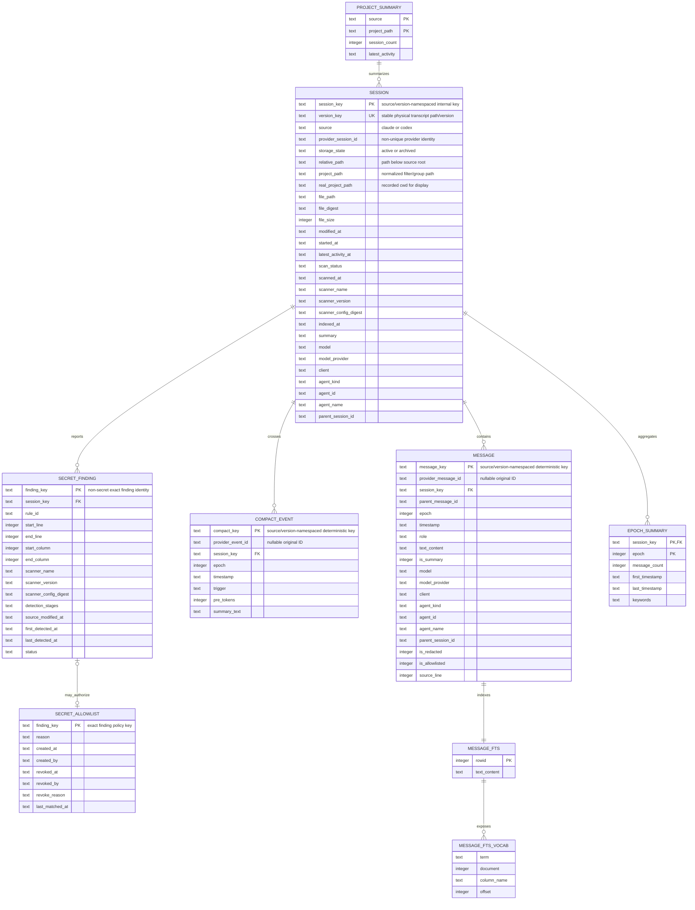
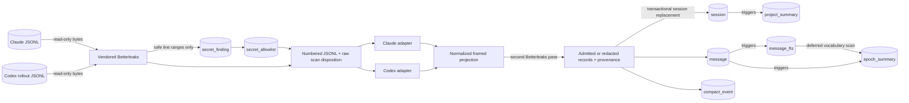
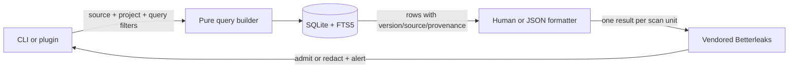

# Database Documentation

## Status

This document describes the target SQLite schema established by [the multi-source chat search design](design-plans/2026-07-19-multi-source-chat-search.md). Until that design is implemented, `src/cc_search_chats/storage/schema.sql` remains the executable schema of record.

## Universe of Discourse

### What This Database Models

The database is a local search and security-policy store over read-only Claude Code and Codex transcript files. It models every physical transcript version, normalized conversation messages, compression boundaries, safe secret-scan findings, exact allowlist decisions, project/epoch aggregates, and FTS5 search structures. Transcript JSONL files remain the source of truth for conversation content; `secret_allowlist` is user-authored local policy and is preserved when derived content is rebuilt.

The persistent index stores clean or explicitly allowlisted user/assistant conversation content, non-searchable redaction markers, and whitelisted provenance. Thinking, arbitrary instruction/context packets, and tool inputs/outputs are outside the persistent domain. `--everything` places available full content in a separate transient in-memory instance of the same schema, but the same Betterleaks gate and allowlist still apply.

### Core Entities

- **Session:** One discovered physical Claude or Codex transcript version. It records source, provider session identity, version-qualified identity, active/archive hierarchy, transcript file generation, project/worktree cwd, scan/index freshness, summary, and session-level provenance. Multiple rows may share a provider session ID.
- **Message:** One normalized user or assistant conversation item within a session and epoch. It carries clean text and the most precise available model/agent provenance.
- **Compact event:** A provider compaction boundary that starts a new epoch and may include a summary and token estimate.
- **Secret finding:** Safe metadata for one Betterleaks finding in one exact JSONL record within a physical transcript version; raw matched content is never stored.
- **Secret allowlist:** User-authored authorization for one exact finding/version/configuration, including review reason and timestamps. It is policy state rather than derived transcript data.
- **Epoch summary:** Derived statistics and keywords for one session epoch.
- **Project summary:** Derived per-source statistics for a recorded project/worktree path.
- **FTS index/vocabulary:** Derived SQLite FTS5 structures for content search and keyword extraction.

### Key Business Rules

- A session row is unique by physical `version_key`; `(source, provider_session_id)` is deliberately non-unique and indexed for grouping.
- Active and archived versions are never collapsed, preferred, or hidden because their provider IDs or content match.
- Messages and compact events belong to exactly one session and are deleted when that session is re-indexed or removed.
- A provider message/event ID is preserved when present; internal identity remains deterministic when it is absent.
- `source` is `claude` or `codex`; `agent_kind` is `main`, `subagent`, or `unknown`.
- Only admitted `user` and `assistant` messages enter the persistent clean-content FTS index. Blocked conversation records retain a safe non-FTS redaction marker with validated role/timestamp/order when possible.
- Message-level provenance overrides session-level defaults; unknown source metadata remains null/`unknown`.
- Project paths are historical transcript metadata and need not currently exist or remain attached as Git worktrees.
- Storage state and root-relative hierarchy are part of physical version provenance and identity.
- Every new or changed transcript generation must have `scan_status = 'clean'` or `'findings'` before its parsed generation can replace prior indexed rows.
- A live transcript scan/index generation is a captured byte prefix read through one descriptor. The raw-pass and committing parse digests must match; concurrent appended bytes are deferred and in-place mutation aborts the transaction.
- `secret_finding` stores no line text, match, secret, validation data, or plaintext secret-derived fingerprint.
- Transcript-authored allow comments never create policy. `secret_allowlist` rows require an explicit operator action and exact finding key; content/config/location changes make the decision stale.
- Transcript files are never changed by database creation, refresh, or rebuild.
- An incompatible database schema version causes an atomic rebuild from scanned transcripts, not an in-place identity migration. Structurally validated allowlist policy is the only old-database data carried forward.

## Entity-Relationship Model

`PROJECT_SUMMARY` has a logical relationship to `SESSION` through `(source, project_path)`; SQLite maintenance triggers enforce the aggregate rather than a foreign key. `MESSAGE_FTS` is an external-content FTS5 table keyed to the `MESSAGE` rowid and excludes redacted rows. `SECRET_ALLOWLIST` intentionally has a logical, not cascading, relationship to `SECRET_FINDING`: a user decision survives derived finding replacement and becomes stale when no current finding has that exact key.

## Data Flow Diagrams

### Persistent clean-content indexing

### Search and recovery

### Transient full-content search

## Data Dictionary

### session

**Purpose:** Indexed transcript identity, file freshness, project/worktree association, and session-level provenance.

**Type:** Entity

| Column | Type | Nullable | Constraints | Business Definition |
|--------|------|----------|-------------|---------------------|
| session_key | TEXT | NO | PK | Deterministic source/version-namespaced internal identity. |
| version_key | TEXT | NO | UNIQUE | Stable physical transcript identity derived from source, storage hierarchy, and root-relative path. It does not change when a live file appends. |
| source | TEXT | NO | CHECK; indexed with provider ID | Transcript source: `claude` or `codex`. |
| provider_session_id | TEXT | NO | Non-unique; indexed with `source` | Provider ID, or documented degraded filename identity when metadata is unavailable. Equal IDs group versions but never collapse them. |
| storage_state | TEXT | NO | CHECK | `active` or `archived`; part of physical provenance. |
| relative_path | TEXT | NO | | Exact path below the selected source root, including dated Codex hierarchy. |
| project_path | TEXT | NO | Indexed/grouped | Normalized project key used for filtering and grouping. |
| real_project_path | TEXT | YES | | Exact recorded cwd used for display and worktree attribution. |
| file_path | TEXT | NO | | Absolute discovered JSONL path. |
| file_digest | TEXT | NO | | Digest of the captured byte prefix covered by the latest successful scan/index; not part of `version_key` or an allowlist key. |
| file_size | INTEGER | NO | CHECK >= 0 | Bytes at last indexing. |
| modified_at | TEXT | NO | ISO 8601 | File mtime used for incremental freshness. |
| started_at | TEXT | YES | ISO 8601 | Earliest safe provider/filename session timestamp. |
| latest_activity_at | TEXT | YES | ISO 8601 | Latest safe provider record timestamp. |
| scan_status | TEXT | NO | CHECK | `pending`, `clean`, `findings`, `failed`, or `stale`; only `clean`/`findings` generations may replace indexed content. |
| scanned_at | TEXT | YES | ISO 8601 | Completion time of the scan covering `file_digest`. |
| scanner_name | TEXT | YES | | `betterleaks` for completed scans. |
| scanner_version | TEXT | YES | | Vendored Betterleaks version used for the generation. |
| scanner_config_digest | TEXT | YES | | Digest of the pinned rule configuration used for the generation. |
| indexed_at | TEXT | NO | ISO 8601 | Last completed index time. |
| summary | TEXT | YES | | Latest normalized session/compaction summary. |
| model | TEXT | YES | | Session fallback model slug. |
| model_provider | TEXT | YES | | Session fallback model provider. |
| client | TEXT | YES | | Safe originator/surface such as Claude Code, Codex CLI, app, or IDE. |
| agent_kind | TEXT | NO | CHECK; default `unknown` | `main`, `subagent`, or `unknown`. |
| agent_id | TEXT | YES | | Provider-supplied agent identity. |
| agent_name | TEXT | YES | | Provider-supplied agent/task name. |
| parent_session_id | TEXT | YES | | Provider-visible parent thread/session identity. |

**Relationships:** Parent of `message.session_key`, `compact_event.session_key`, `secret_finding.session_key`, and `epoch_summary.session_key`. Logically contributes to `project_summary` through `(source, project_path)`.

### message

**Purpose:** Clean normalized user/assistant content searchable by FTS and recoverable by session/epoch/context.

**Type:** Entity

| Column | Type | Nullable | Constraints | Business Definition |
|--------|------|----------|-------------|---------------------|
| message_key | TEXT | NO | PK | Deterministic internal reference; source/version-namespaced when provider ID is absent. |
| provider_message_id | TEXT | YES | Indexed with session/source as needed | Original provider message UUID/ID. |
| session_key | TEXT | NO | FK `session`, ON DELETE CASCADE | Owning session. |
| parent_message_id | TEXT | YES | | Provider-visible parent message identity when available. |
| epoch | INTEGER | NO | CHECK >= 0; default 0 | Compression epoch containing this message. |
| timestamp | TEXT | NO | ISO 8601 | Provider timestamp retained as text. |
| role | TEXT | NO | CHECK | `user` or `assistant`. |
| text_content | TEXT | NO | default empty | Normalized clean conversation text. |
| is_summary | INTEGER | NO | CHECK 0/1 | Whether the message represents a compression summary. |
| model | TEXT | YES | | Most precise model slug for this message/turn. |
| model_provider | TEXT | YES | | Most precise model provider. |
| client | TEXT | YES | | Most precise safe client/originator. |
| agent_kind | TEXT | NO | CHECK; default `unknown` | `main`, `subagent`, or `unknown`. |
| agent_id | TEXT | YES | | Provider-supplied agent identity. |
| agent_name | TEXT | YES | | Provider-supplied agent/task name. |
| parent_session_id | TEXT | YES | | Parent session/thread identity for agent attribution. |
| is_redacted | INTEGER | NO | CHECK 0/1; default 0 | Record intersects at least one non-allowlisted finding; text is a fixed safe marker and excluded from FTS. |
| is_allowlisted | INTEGER | NO | CHECK 0/1; default 0 | Record content was admitted because every intersecting finding had an active exact allowlist decision. |
| source_line | INTEGER | YES | CHECK > 0 | Original JSONL line used for ordered extraction and safe remediation location. |

**Relationships:** Belongs to `session`; admitted non-redacted rows maintain one FTS row; every row contributes to extraction order and one `epoch_summary` row.

### compact_event

**Purpose:** Compression boundary and summary metadata that starts a new session epoch.

**Type:** Entity

| Column | Type | Nullable | Constraints | Business Definition |
|--------|------|----------|-------------|---------------------|
| compact_key | TEXT | NO | PK | Deterministic source/version-namespaced internal identity. |
| provider_event_id | TEXT | YES | | Original provider boundary ID when supplied. |
| session_key | TEXT | NO | FK `session`, ON DELETE CASCADE | Owning session. |
| epoch | INTEGER | NO | CHECK > 0 | Epoch started by this boundary. |
| timestamp | TEXT | NO | ISO 8601 | Boundary timestamp. |
| trigger | TEXT | NO | | Provider trigger such as `auto`, `manual`, or `unknown`. |
| pre_tokens | INTEGER | NO | CHECK >= 0; default 0 | Known pre-compaction token estimate; zero when unavailable. |
| summary_text | TEXT | YES | | Source-supplied or normalized compaction summary. |
| is_redacted | INTEGER | NO | CHECK 0/1; default 0 | Tainted boundary retained only for epoch structure; summary text is a fixed marker. |
| source_line | INTEGER | YES | CHECK > 0 | Original JSONL boundary line. |

**Relationships:** Belongs to `session`.

### secret_finding

**Purpose:** Current safe remediation metadata for a vendored Betterleaks finding in an exact transcript generation.

**Type:** Derived security observation

| Column | Type | Nullable | Constraints | Business Definition |
|--------|------|----------|-------------|---------------------|
| finding_key | TEXT | NO | PK | Stable exact-finding identity derived from source/version/location, full-record digest, rule, and config—not the matched value or whole-file digest. |
| session_key | TEXT | NO | FK `session`, ON DELETE CASCADE | Physical transcript version containing the finding. |
| rule_id | TEXT | NO | | Pinned Betterleaks rule identifier. |
| start_line | INTEGER | NO | CHECK > 0 | First affected JSONL line. |
| end_line | INTEGER | NO | CHECK >= start | Last affected JSONL line. |
| start_column | INTEGER | YES | CHECK > 0 | Safe first-column coordinate when supplied. |
| end_column | INTEGER | YES | CHECK >= start | Safe last-column coordinate when supplied. |
| scanner_name | TEXT | NO | CHECK | `betterleaks`. |
| scanner_version | TEXT | NO | | Vendored executable version. |
| scanner_config_digest | TEXT | NO | | Exact pinned configuration digest. |
| detection_stages | TEXT | NO | CHECK | Canonically ordered set of `raw`, `normalized`, and/or `output`; never scanner value data. |
| source_modified_at | TEXT | NO | ISO 8601 | Transcript mtime covered by the observation. |
| first_detected_at | TEXT | NO | ISO 8601 | First local detection time for this exact key. |
| last_detected_at | TEXT | NO | ISO 8601 | Most recent confirming scan. |
| status | TEXT | NO | CHECK | `open`, `allowlisted`, or `resolved`; derived from current scans and policy. |

Forbidden columns/data include raw line text, match text, secret text, decoded secret, scanner validation metadata, scanner stderr, and plaintext secret hashes/fingerprints.

### secret_allowlist

**Purpose:** Local operator policy admitting one exact finding from one immutable JSONL record within one physical transcript version.

**Type:** Authoritative local policy

| Column | Type | Nullable | Constraints | Business Definition |
|--------|------|----------|-------------|---------------------|
| finding_key | TEXT | NO | PK; logical relationship to `secret_finding` | Exact finding authorized; no global rule/token/path wildcards. |
| reason | TEXT | NO | non-empty; bounded; scanner-clean | Operator-supplied false-positive justification, scanned before persistence and never echoed on rejection. |
| created_at | TEXT | NO | ISO 8601 | Decision timestamp. |
| created_by | TEXT | YES | | Safe local operator name when available. |
| revoked_at | TEXT | YES | ISO 8601 | Revocation timestamp; null while active. |
| revoked_by | TEXT | YES | | Safe local operator name for revocation. |
| revoke_reason | TEXT | YES | bounded; scanner-clean | Operator-supplied revocation explanation, scanned before persistence. |
| last_matched_at | TEXT | YES | ISO 8601 | Most recent scan on which this exact policy matched a current finding. |

Transcript-authored allow comments never populate this table. Operator reasons are length-limited and must pass the same offline scanner before insertion; rejected text is not logged or echoed. A decision becomes stale automatically when its finding key no longer exists, including after the flagged record content, storage location/version, line coordinates, rule set, or scanner configuration changes. Appending unrelated records does not change the existing record digest/key. Stale/revoked rows remain auditable and do not admit content. These rows are copied through incompatible derived-index rebuilds after strict structural validation; all conversation and finding rows are rebuilt instead.

### epoch_summary

**Purpose:** Trigger-maintained per-epoch counts/time bounds plus deferred search keywords.

**Type:** Derived aggregate

| Column | Type | Nullable | Constraints | Business Definition |
|--------|------|----------|-------------|---------------------|
| session_key | TEXT | NO | Composite PK; FK `session`, ON DELETE CASCADE | Owning session. |
| epoch | INTEGER | NO | Composite PK; CHECK >= 0 | Epoch identity within the session. |
| message_count | INTEGER | NO | CHECK >= 0 | Current normalized messages in the epoch. |
| first_timestamp | TEXT | YES | ISO 8601 | Earliest message timestamp. |
| last_timestamp | TEXT | YES | ISO 8601 | Latest message timestamp. |
| keywords | TEXT | YES | Derived comma-separated cache | Deferred top keywords from FTS vocabulary. |

### project_summary

**Purpose:** Trigger-maintained activity summary for a project/worktree path within one transcript source.

**Type:** Derived aggregate

| Column | Type | Nullable | Constraints | Business Definition |
|--------|------|----------|-------------|---------------------|
| source | TEXT | NO | Composite PK; CHECK | Transcript source. |
| project_path | TEXT | NO | Composite PK | Normalized project/worktree grouping path. |
| session_count | INTEGER | NO | CHECK >= 0 | Indexed sessions for this source/path. |
| latest_activity | TEXT | YES | ISO 8601 | Latest session mtime for this source/path. |

### message_fts

**Purpose:** External-content FTS5 index over `message.text_content`.

**Type:** Derived virtual table

| Column | Type | Nullable | Constraints | Business Definition |
|--------|------|----------|-------------|---------------------|
| rowid | INTEGER | NO | Logical PK linked to `message.rowid` | FTS-to-message join identity. |
| text_content | TEXT | NO | FTS5 indexed | Searchable normalized message content. |

### message_fts_vocab

**Purpose:** FTS5 instance vocabulary used for deferred per-epoch keyword scoring.

**Type:** Derived virtual table

| Column | Type | Nullable | Constraints | Business Definition |
|--------|------|----------|-------------|---------------------|
| term | TEXT | NO | FTS5 generated | Indexed token. |
| doc | INTEGER | NO | FTS5 generated | Message FTS rowid. |
| col | TEXT | NO | FTS5 generated | Indexed column name. |
| offset | INTEGER | NO | FTS5 generated | Token position. |

## Design Decisions

### Source-and-Version-Namespace Internal Identities

**Date:** 2026-07-19  
**Design plan:** `docs/design-plans/2026-07-19-multi-source-chat-search.md`  
**Decision:** Use deterministic internal keys namespaced by source and physical transcript version while retaining non-unique provider-visible IDs separately.  
**Rationale:** Claude and Codex IDs may collide, active/archive files may represent distinct versions with the same provider ID, and historical Codex messages may lack IDs. Internal keys must be total and collision-safe without hiding versions or changing existing Claude output.  
**Alternatives rejected:** Global raw-provider primary keys (silent collision/version loss); preferring active or content-deduplicating archives (hides critical history); separate databases (duplicated query behavior); random generated keys (unstable across rebuilds).

### Rebuild Incompatible Derived Indexes

**Date:** 2026-07-19  
**Design plan:** `docs/design-plans/2026-07-19-multi-source-chat-search.md`  
**Decision:** Record an internal SQLite schema version and atomically rebuild derived content through the scanner when the identity or containment layout is incompatible; carry forward only validated allowlist policy.  
**Rationale:** SQLite cannot add the required primary/foreign-key structure safely through the existing additive migration path, and a pre-containment index may already contain toxic content. All conversation rows are reproducible from read-only transcripts, while explicit allowlist decisions are not.  
**Alternatives rejected:** Multi-table content copy migration (preserves possible secrets and adds corruption/trigger risk); dropping allowlist policy (loses operator decisions); retaining global keys (does not meet collision requirements).

### Typed Provenance Columns

**Date:** 2026-07-19  
**Design plan:** `docs/design-plans/2026-07-19-multi-source-chat-search.md`  
**Decision:** Store a fixed, nullable provenance vocabulary on sessions/messages instead of raw provider JSON.  
**Rationale:** Callers need model and agent attribution, but arbitrary transcript metadata can contain sensitive prompts, credentials, and unstable provider fields. Typed columns make null/unknown semantics and additive output explicit.  
**Alternatives rejected:** Raw JSON metadata (privacy and stability risk); session-only attribution (incorrect when model/agent changes mid-session).

### Scan-Before-Parse Containment with Parsed Redaction

**Date:** 2026-07-19  
**Design plan:** `docs/design-plans/2026-07-19-multi-source-chat-search.md`  
**Decision:** Scan a captured raw transcript byte prefix with the vendored offline Betterleaks binary, parse numbered JSONL records with raw finding dispositions, scan a framed decoded-plaintext projection before SQLite, reparse the same bounded prefix to write admitted/redacted rows, and scan framed units plus final materialized output before stdout. The raw and committing parse digests must match.  
**Rationale:** The contamination path is source transcript to index/transient storage to output to a new transcript. Raw scanning audits all toxic source material; the normalized pass catches values revealed by JSON unescaping, decoding, or parser concatenation; reparsing avoids buffering or spooling unscanned candidate content; digest equality closes live-file mutation races; parsed dispositions preserve useful ordering, roles, timestamps, and epochs; the egress passes cover cross-unit, legacy, and implementation bypasses.  
**Alternatives rejected:** Pre-commit-only scanning (does not protect chat data); scanning after persistence (already duplicates the secret); byte-splicing raw JSON from scanner columns (can corrupt escaping/structure); dropping whole sessions (unnecessarily loses clean records); trusting transcript allow comments (untrusted input controls policy).

### Exact SQLite Allowlist Policy

**Date:** 2026-07-19  
**Design plan:** `docs/design-plans/2026-07-19-multi-source-chat-search.md`  
**Decision:** Store allow decisions only for exact finding keys scoped to physical transcript version, source line/range, full JSONL record digest, rule, and scanner configuration; require a reason and preserve decisions across derived rebuilds. The whole-file digest is deliberately excluded.  
**Rationale:** False positives need a review path, but a global token/rule/path exception would allow the same potential secret to spread across transcripts. Exact scope makes file/config changes and copied occurrences require independent review without storing the matched value.  
**Alternatives rejected:** Provider-wide/rule-wide allowlists (large bypass radius); raw-secret or plaintext-secret-hash keys (creates sensitive derivative data); inline comments (transcript-controlled); deleting decisions on rebuild (not reproducible policy).

### Vendored Betterleaks Runtime

**Date:** 2026-07-19  
**Design plan:** `docs/design-plans/2026-07-19-multi-source-chat-search.md`  
**Decision:** Vendor immutable Betterleaks v1.6.1 release archives, licence, checksums/signature evidence, pinned configuration, and a runtime platform manifest for Darwin/Linux/Windows x64/arm64.  
**Rationale:** Containment must not silently disappear because a PATH dependency is absent or a runtime download fails. Betterleaks is the maintained Gitleaks successor, supports stdin/JSON/redaction, and is MIT-licensed.  
**Alternatives rejected:** Optional system Gitleaks/Betterleaks (fail-open installation variance); runtime download (network/supply-chain/availability boundary); TruffleHog verification (network credential exposure risk); detect-secrets alone (narrower line-oriented engine and separate repository-hygiene focus).

### Shared External-Content FTS5 Index

**Date:** 2026-07-19  
**Design plan:** `docs/design-plans/2026-07-19-multi-source-chat-search.md`  
**Decision:** Continue using one external-content FTS5 table synchronized only from admitted, non-redacted normalized messages.  
**Rationale:** Both providers share clean conversation search semantics after normalization, and one index preserves combined ranking/local-first behavior.  
**Alternatives rejected:** Per-source FTS databases (merge/ranking complexity); direct live scanning for default search (loses incremental indexing).

### Historical Working Directory as Project Identity

**Date:** 2026-07-19  
**Design plan:** `docs/design-plans/2026-07-19-multi-source-chat-search.md`  
**Decision:** Preserve the exact recorded cwd for display and use a normalized path for lookup without requiring current filesystem/Git existence. Treat the primary checkout and every linked/temporary worktree cwd as distinct projects even when they share a Git common directory.  
**Rationale:** Worktrees can be detached, locked, moved, pruned, deleted, or created temporarily by Codex while their chats remain valuable history. Their directory hierarchy already carries useful relationship context without collapsing their separate task histories.  
**Alternatives rejected:** Requiring a live Git worktree (loses historical sessions); grouping by Git common directory (silently merges distinct worktree histories); destructively canonicalizing display paths (loses provenance).

## Denormalisation Register

| Table.Column | Justification | Measured Evidence | Sync Strategy |
|-------------|---------------|-------------------|---------------|
| `project_summary.session_count` / `latest_activity` | Existing derived cache for project/session listing. | No historical benchmark is recorded; retained as an existing schema/query contract. | SQLite triggers on session insert/delete/update. |
| `epoch_summary.message_count` / timestamp bounds | Existing derived cache for list/extract metadata. | No historical benchmark is recorded; retained as an existing schema/query contract. | SQLite triggers on message insert/delete. |
| `epoch_summary.keywords` | Existing deferred top-keyword cache avoids recomputing TF-IDF presentation data on every read. | Existing keyword extraction tests establish behavior; no performance benchmark is recorded. | Explicit deferred refresh from `message_fts_vocab`. |
| `message_fts.text_content` | FTS5 search projection of admitted canonical message text. | FTS5 is the established search implementation and required for query behavior. | SQLite insert/delete/update triggers on `message`, guarded by `is_redacted = 0`. |
