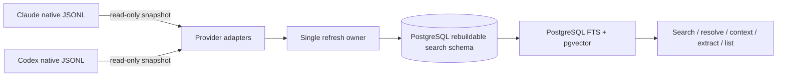

# Cross-Vendor Semantic Search Design

**Status:** Current design

**GitHub Issue:** None

## Authority Sources

| Decision or instruction | Exact source | Resolver | Resolution condition |
|---|---|---|---|
| Index the isolated Claude and Codex Ponytail session corpora while keeping message attribution out of this delivery. | `ccchat:v1:codex:01a0222a-8cf2-7a12-ac38-2c0f471f81b2:id:msg_01a0227b-a5d7-70f0-9eac-ecfdfe195d77` | `sed -n '812p' /home/brian/.codex/sessions/2026/08/21/rollout-2026-08-21T12-33-29-01a0222a-8cf2-7a12-ac38-2c0f471f81b2.jsonl` | Exactly one native user `response_item` states both boundaries. |
| Retain crash/generation records but do not retain unused message, alias, or embedding copies. | `ccchat:v1:codex:01a0222a-8cf2-7a12-ac38-2c0f471f81b2:id:msg_01a0229d-4034-7ec2-b5b0-7923a3b8afe9` | `sed -n '916p' /home/brian/.codex/sessions/2026/08/21/rollout-2026-08-21T12-33-29-01a0222a-8cf2-7a12-ac38-2c0f471f81b2.jsonl` | Exactly one native user `response_item` accepts generation metadata and rejects unused copies. |
| Proceed with the reconciled storage, freshness, Ponytail, UAT, and documentation work. | `ccchat:v1:codex:01a0222a-8cf2-7a12-ac38-2c0f471f81b2:id:msg_01a022a9-3b5a-70d1-ab14-b7b2a363589c` | `sed -n '927p' /home/brian/.codex/sessions/2026/08/21/rollout-2026-08-21T12-33-29-01a0222a-8cf2-7a12-ac38-2c0f471f81b2.jsonl` | Exactly one native user `response_item` says `do it`. |
| Accept this reconciled design as matching the intended outcome. | `ccchat:v1:codex:01a0222a-8cf2-7a12-ac38-2c0f471f81b2:id:msg_01a02398-fc3a-7670-8f76-e267cfe92208` | `sed -n '1338p' /home/brian/.codex/sessions/2026/08/21/rollout-2026-08-21T12-33-29-01a0222a-8cf2-7a12-ac38-2c0f471f81b2.jsonl` | Exactly one native user `response_item` accepts the rendered design. |
| Treat same-inode growth as append-only so refresh reads only the new suffix. | `ccchat:v1:codex:01a0222a-8cf2-7a12-ac38-2c0f471f81b2:id:msg_01a026ca-e241-7722-b606-ab5429dc3c86` | `sed -n '2295p' /home/brian/.codex/sessions/2026/08/21/rollout-2026-08-21T12-33-29-01a0222a-8cf2-7a12-ac38-2c0f471f81b2.jsonl` | Exactly one native user `response_item` says `yes` to the immediately preceding explicit fast-append-only question. |
| Treat PostgreSQL as a rebuildable projection of authoritative native chats rather than a separately backed-up content authority. | `ccchat:v1:codex:01a0324d-aec0-7991-88b0-3ad1baedf614:id:msg_01a03609-cf3b-7831-94dd-c63629653925` | `sed -n '670p' /home/brian/.codex/sessions/2026/08/24/rollout-2026-08-24T15-45-46-01a0324d-aec0-7991-88b0-3ad1baedf614.jsonl` | Exactly one native user `response_item` states that the database is a copy of system chats. |
| Replace the blocking search-time refresh with one background incremental refresh and return an answer with explicit staleness. | `ccchat:v1:codex:01a0324d-aec0-7991-88b0-3ad1baedf614:id:msg_01a036fa-9e3f-7ad3-acd8-f2b2973cdafc` | `sed -n '860p' /home/brian/.codex/sessions/2026/08/24/rollout-2026-08-24T15-45-46-01a0324d-aec0-7991-88b0-3ad1baedf614.jsonl` | Exactly one native user `response_item` accepts the background-refresh boundary and requires a stale answer rather than blocking. |
| Admit at most one automatic refresh per five-minute cooldown while live logs continue growing. | `ccchat:v1:codex:01a0324d-aec0-7991-88b0-3ad1baedf614:id:msg_01a036fb-2e06-7981-8e05-5b5d4b006967` | `sed -n '868p' /home/brian/.codex/sessions/2026/08/24/rollout-2026-08-24T15-45-46-01a0324d-aec0-7991-88b0-3ad1baedf614.jsonl` | Exactly one native user `response_item` requests a five-minute interval between automatic reindexes. |
| Use five seconds provisionally as the total interval from search request to returned answer, then tune it from measured spin-up costs. | `ccchat:v1:codex:01a0324d-aec0-7991-88b0-3ad1baedf614:id:msg_01a03821-f0f6-7540-8182-a7405fdfce82` | `sed -n '885p' /home/brian/.codex/sessions/2026/08/24/rollout-2026-08-24T15-45-46-01a0324d-aec0-7991-88b0-3ad1baedf614.jsonl` | Exactly one native user `response_item` defines five seconds as request-to-return and makes later tuning conditional on measurements. |
| Number ordinary published corpora rather than calling routine ingests revisions. | `ccchat:v1:codex:01a05687-b8b7-76f0-a949-015d6ac3f940:id:msg_01a05a03-365b-7a11-ac04-688b546f312e` | `sed -n '478p' /home/brian/.codex/sessions/2026/08/31/rollout-2026-08-31T16-35-30-01a05687-b8b7-76f0-a949-015d6ac3f940.jsonl` | Exactly one native user `response_item` says numbering corpora is a better naming scheme than revision. |
| Treat automatic incremental reindex as one full literal-and-semantic update; let ranked search wait only inside its five-second response deadline; otherwise return the newest fully completed corpus with its age and continuing update state. | `ccchat:v1:codex:01a05687-b8b7-76f0-a949-015d6ac3f940:id:msg_01a05a60-0fb6-7ef3-977c-ed7fc7d56f8e` | `sed -n '1048p' /home/brian/.codex/sessions/2026/08/31/rollout-2026-08-31T16-35-30-01a05687-b8b7-76f0-a949-015d6ac3f940.jsonl` | Exactly one native user `response_item` rejects half-only search updates and states the five-minute, five-second, continuing-update, and answer-age contract. |
| Accept the rendered coherent-refresh contract, including that a half-updated corpus is never presented as current. | `ccchat:v1:codex:01a05687-b8b7-76f0-a949-015d6ac3f940:id:msg_01a05a61-a56b-7e82-b7e3-59a26d47b91c` | `sed -n '1070p' /home/brian/.codex/sessions/2026/08/31/rollout-2026-08-31T16-35-30-01a05687-b8b7-76f0-a949-015d6ac3f940.jsonl` | Exactly one native user `response_item` says `yes` to the immediately preceding six-clause coherent-refresh contract. |
| Accept the revised written contract, including the schema-version-3 corpus naming cutover, for implementation planning. | `ccchat:v1:codex:01a05687-b8b7-76f0-a949-015d6ac3f940:id:msg_01a05a86-c142-7541-84fc-b45ebaafecc3` | `sed -n '1659p' /home/brian/.codex/sessions/2026/08/31/rollout-2026-08-31T16-35-30-01a05687-b8b7-76f0-a949-015d6ac3f940.jsonl` | Exactly one native user `response_item` says `yes?` to the immediately preceding question asking whether the written contract, including the schema-version-3 rename, matches the intended implementation. |
| Throttle automatic full updates from the preceding update's completion so continuously growing transcripts do not cause recomputation on every search. | `ccchat:v1:codex:01a05687-b8b7-76f0-a949-015d6ac3f940:id:msg_01a05a8c-6d29-7172-879f-ae510f10cdcc` | `sed -n '1855p' /home/brian/.codex/sessions/2026/08/31/rollout-2026-08-31T16-35-30-01a05687-b8b7-76f0-a949-015d6ac3f940.jsonl` | Exactly one native user `response_item` states that transcripts normally keep changing and rejects recomputing on every search. |
| Finish the cleanup and release only a version that satisfies the repaired behavior, while the human holds off using the broken search path. | `ccchat:v1:codex:01a0324d-aec0-7991-88b0-3ad1baedf614:id:msg_01a04cdd-2dd8-7491-9a1d-eba2472fb46a` | `sed -n '1579p' /home/brian/.codex/sessions/2026/08/24/rollout-2026-08-24T15-45-46-01a0324d-aec0-7991-88b0-3ad1baedf614.jsonl` | Exactly one native user `response_item` requests proper cleanup and a working release, and says they will hold off meanwhile. |

## Summary

Extend `cc-search-chats` from Claude-only full-text search into a local,
cross-vendor search and exact-resolution tool for native Claude and Codex chat
logs. A dedicated PostgreSQL 18 database is the derived search authority for
normalized metadata, PostgreSQL full-text search, and pgvector
embeddings. Large search relations and indexes live in a dedicated tablespace
on configured external storage; PostgreSQL data and WAL remain operator-managed.
Search reads only a jointly published literal-and-semantic corpus. When that
corpus is at least five minutes old, ranked search admits or joins
one low-priority full incremental update and waits for publication only inside
its provisional five-second end-to-end deadline. If publication finishes while
enough budget remains to retrieve and render, search opens a new read transaction;
otherwise it queries the newest fully completed corpus and reports its exact
age plus the continuing update state. Systemd owns the update after the search
process exits. Search always attempts literal retrieval and fuses semantic
candidates only when query embedding fits the remaining deadline; query-side
semantic failure still returns literal results from the same coherent corpus.
Refresh never locks or writes the vendor logs that supervisors are writing.
Corpus-generation and semantic-build records are small publication and recovery
records; they never own full copies of messages, physical aliases, or embeddings.

## Definition of Done

- Ranked natural-language and exact-term queries search native Claude and Codex
  chats from one completed corpus. Literal candidates are always obtained first.
  Query embedding and semantic retrieval may enrich them only when that work
  finishes within the request deadline; otherwise the same request succeeds
  with literal results and explicit query-side semantic degradation. Agy and
  the transport archive are out of scope as searchable corpora.
- Default results include only visible user/assistant prose from primary sessions. `--agents` includes Claude subagent and Codex child-agent conversations. `--tools` adds lexical-only tool names, inputs, and results. Reasoning and developer/system instructions remain excluded.
- Embedding and retrieval run locally. Once the model is installed, searches work offline and transmit no chat content.
- An overnight bulk job maintains the baseline. Search requests never run migrations or a baseline rebuild: when the newest coherent corpus is at least five minutes old, they may admit or join one full background update, wait only within a provisional five-second end-to-end deadline, and report the exact completed corpus, age, coverage, and background state used for the answer.
- Every indexed record has a provider-qualified stable locator. Exact resolution is independent of search ranking and distinguishes unique, missing, ambiguous, stale, unavailable, malformed, and unsupported-schema outcomes.
- Search, context, extract, list, and reference-only output share one additive JSON identity shape. Results report provider roots, projects or repositories, files searched, skipped or unreadable sources, unrecognised conversation-shaped records, and index freshness.
- Large indexes and local model data live under a configured external-storage root rather than inside the repository. The tool does not render transcript archives, summarise chats, or write notes, ADRs, plans, or constraints.
- Native Claude and Codex chats remain the content authority. Message
  attribution, receipt correlation, and authorship classification are deferred
  comms-plumbing work and are not changed or accepted by this delivery.

## Current implementation defect

The installed implementation does not yet satisfy the coherent automatic-update
contract. `cli._handle_postgres` launches the packaged
`src/cc_search_chats/systemd/cc-search-chats-refresh.service` only after
retrieval, the service runs `index --literal-only --background-refresh`, and a
literal corpus can therefore become current while its semantic publication
remains on an older corpus. Search does not spend any of its response budget
waiting for a newly admitted or already-running update. Current output reports
the literal and semantic ages separately, but that observability does not turn a
half-updated pair into the one completed corpus required here.

The existing incremental parser checkpoints, reusable embedding values,
single-flight PostgreSQL ownership, durable automatic-request state, systemd
handoff, and five-second request clock remain usable foundations. The repair must
compose them into one candidate update and one final publication boundary rather
than adding another refresh lane or retaining permanent full corpus copies.

## Acceptance Criteria

### cross-vendor-semantic-search.AC1: Native cross-vendor search

- **Success:** One default query can return ranked native Claude and Codex
  prose results, and every result identifies its provider and native session.
- **Success:** Natural-language search attempts FTS retrieval first. Once those
  candidates exist, it fuses semantic ranks only when query embedding finishes
  within the request deadline; otherwise it returns the FTS candidates with
  `literal_fallback` coverage. `--literal` performs FTS-only retrieval without
  loading the embedding model.
- **Failure:** Agy sessions and rendered transport archives never enter the
  searchable corpus, even when their files are reachable from a configured
  source root.

### cross-vendor-semantic-search.AC2: Content and session boundaries

- **Success:** Default results contain only visible user/assistant prose from
  sessions positively classified as primary.
- **Success:** `--agents` additionally includes sessions classified as agent or
  unknown, and reports the retained classification. `--tools` additionally
  searches persisted tool names, inputs, and results through FTS only.
- **Success:** `--literal --tools --exhaustive` pages or streams every matching
  tool or prose occurrence in deterministic locator order. It is an explicitly
  selected enumeration operation, not a ranked interactive answer, and is
  therefore exempt from the five-second ranked-search deadline. Ranked search
  never claims to be exhaustive.
- **Failure:** Reasoning, thinking, developer instructions, system instructions,
  injected context, and unrecognised content shapes are not indexed or returned
  by any flag. The existing `--everything` flag is rejected with migration
  guidance rather than retaining its reasoning-inclusive meaning.

### cross-vendor-semantic-search.AC3: Local semantic model

- **Success:** Semantic passages and queries use
  `nvidia/Nemotron-3-Embed-8B-BF16`, the model-card passage/query prefixes,
  1024-dimensional Matryoshka slicing, and post-slice normalization.
- **Success:** After explicit installation into the operator-configured model
  cache, indexing and search work with network access disabled and transmit no
  chat content.
- **Failure:** Missing semantic dependencies or model files produce a nonzero,
  machine-readable error for explicit model validation and semantic-maintenance
  commands. Ranked search instead returns its literal answer with named
  `literal_fallback` degradation and remediation state. No runtime command
  downloads a model implicitly or redirects package/model caches.

### cross-vendor-semantic-search.AC4: Scheduled and on-demand freshness

- **Success:** Explicit maintenance can migrate and build the baseline. The
  scheduled nightly command refreshes literal and semantic state without
  applying an unreviewed schema migration. Search itself never migrates or
  performs a baseline rebuild.
- **Success:** When the newest jointly published corpus is at least five
  minutes old, search atomically admits or joins at most one automatic full
  literal-and-semantic update. The low-priority background owner survives the
  requesting CLI process, and concurrent searches reuse its state rather than
  launching duplicate work. Completion starts a five-minute quiet period;
  searches during that period do not admit another update even though native
  transcripts may continue growing.
- **Boundary:** The automatic update's scope does not change with the query's
  retrieval mode: default and ranked `--literal` searches both request the same
  full update. Explicit operator-invoked `index --literal-only` remains a
  literal-only maintenance capability, but its output cannot be labelled a
  complete hybrid corpus.
- **Success:** Native Claude/Codex writers are never locked. Each refresh records
  a per-file byte watermark, and a source that advances during refresh is
  reported as advanced rather than falsely described as fully current.
- **Success:** One cross-process update owner serializes index writes. Search
  never acquires its lock or local admission file; it may await the owner's
  publication wake-up notification, backed by durable database state, only
  while enough of the same five-second deadline remains to retrieve, serialize,
  and render. Manual maintenance may wait without the ranked-search deadline
  while reporting the active owner.
- **Success:** Literal rows, semantic mappings, and their shared corpus identity
  become current in one short publication transaction. Before that transaction,
  every search sees the previous fully completed corpus. Semantic failure or
  interruption leaves the previous corpus current and the candidate
  diagnosable/retryable.
- **Failure:** Truncation, rotation, replacement, same-size modification,
  partial final JSONL records, and unsupported parser-state changes cannot be
  mistaken for a clean append. The affected source is reparsed or skipped with
  an explicit reason.
- **Success:** An unchanged second refresh reads source metadata but no JSONL
  content bytes; a valid append reads only the suffix after the last complete
  record watermark.
- **Success:** A deterministic parse failure retains the last fully understood
  byte/parser checkpoint plus a separate fingerprint of the failed observation.
  An unchanged blocked source is reported as partial coverage without reopening
  its JSONL. Source metadata or parser-version change invalidates that fingerprint;
  transient I/O failures use an explicit retry time and manual maintenance can
  force retry.
- **Boundary:** Same-device/inode growth is accepted as append-only. Refresh
  does not re-read the committed prefix and therefore does not claim to detect
  an earlier in-place rewrite combined with growth.

### cross-vendor-semantic-search.AC5: Observable work and semantic failure

- **Success:** Scan, parse, FTS commit, model preflight/load, embedding, semantic
  commit, query embedding, retrieval, and completion emit structured phase,
  elapsed-time, completed-unit, total-unit when known, and freshness events.
- **Success:** Human output names an ordinary ingest publication as `corpus N`;
  JSON names the same number `corpus_generation`. Routine ingest state is not
  called a revision. Schema evolution remains separately identified by
  `schema_version` and the migration ledger.
- **Success:** Search measures one monotonic end-to-end deadline from request
  receipt through rendered output. The initial default is five seconds; output
  reports the configured deadline, elapsed time, retrieval mode, completed
  corpus/as-of time and `corpus_age_ms`, staleness reasons, and any background
  run/request ID.
- **Success:** A minimal console bootstrap records the request clock before
  importing command, database, or semantic modules. Acceptance measures the
  externally visible interval from executable invocation through process exit
  while draining stdout, so interpreter and import spin-up remain part of the
  five-second product boundary rather than disappearing from telemetry.
- **Success:** A stale search admits or joins the full update before selecting
  the corpus it will query. If the update publishes while sufficient response
  budget remains, search queries the new corpus; otherwise it queries the
  previous completed corpus. It then obtains literal candidates before
  optional semantic query work. Semantic query work executes behind a
  cancellable process boundary and is admitted only while deadline remains. If
  it cannot finish, the command returns literal results from that same corpus
  rather than exceeding the deadline.
- **Success:** Every search-side PostgreSQL statement, automatic-update launch
  attempt, bounded publication wait, semantic child, cleanup/reap step,
  serialization step, and rendering reserve derives its budget from that same
  monotonic deadline. A launch, wait, or optional child that exhausts its budget
  is terminated or detached from without converting an answer from the last
  completed corpus into a failure.
- **Success:** Human output and NDJSON progress identify the active background
  index owner. Long maintenance phases continue heartbeating in durable run
  state and the systemd journal after the requesting search has returned.
- **Failure:** If semantic work for a candidate update fails, neither its literal
  rows nor semantic mappings become current. The last completed corpus remains
  searchable, validated reusable vectors remain retryable inputs, and output
  names the failed continuing-update state rather than presenting the candidate
  as partially current.
- **Failure:** Model-load, query-embedding, VRAM, or deadline failure reports the
  failed/degraded phase and semantic freshness while returning the already
  computed literal answer. No alternate model is selected. Database
  unavailability or failure to obtain literal results within the deadline remains
  a named nonzero failure because no answer can be fabricated safely.

### cross-vendor-semantic-search.AC6: Stable identity and exact resolution

- **Success:** Search, context, extract, list, and reference-only output use the
  same provider-qualified identity object and
  canonical locator string.
- **Success:** Exact resolution uses provider/session/record identity and source
  verification, not FTS or semantic ranking. Physical duplicate records resolve
  to one logical message with explicit physical aliases.
- **Failure:** Exact resolution distinguishes malformed locator, unsupported
  provider schema, unavailable source, stale locator/index, no match, and
  multiple matches. It never collapses those outcomes into an empty result.

### cross-vendor-semantic-search.AC7: Coverage and JSON contract

- **Success:** Every JSON command returns an object with `schema_version`,
  command, identity-bearing results, source coverage, refresh state, semantic
  state, warnings, and a terminal status. Additive fields do not change existing
  field meanings within a schema version.
- **Success:** Coverage reports configured and resolved provider roots, projects
  or repositories, metadata-checked/unchanged/content-read/indexed/excluded/
  blocked/transient-failure/removed file counts, bytes read, appended versus
  replacement work, unknown session kinds, unrecognised conversation-shaped
  records, and source watermarks. Attempted reads cannot be reported as zero
  merely because their staged rows were rejected.
- **Failure:** A partial scan or skipped source cannot produce
  `completeness = "complete"`. Progress uses stderr so stdout remains one valid
  final JSON document.

### cross-vendor-semantic-search.AC8: Storage and component ownership

- **Success:** The dedicated database stores all large search tables and indexes,
  including staged and current vectors, in a PostgreSQL tablespace below a
  configured external data root. Search-schema migrations, refresh, and maintenance
  are confined to rebuildable search relations. Refresh ownership, status, and
  generation state are transactional PostgreSQL state rather than ad hoc
  lock/status files.
- **Success:** Before refresh, the application verifies the tablespace location,
  configured mount identity, writability, and sufficient peak rebuild space. A
  missing/read-only/replaced external mount fails without creating a fallback
  search database or writing into the underlying root-filesystem mountpoint.
- **Failure:** If PostgreSQL or the search database is unavailable, all search
  modes fail with a named database-unavailable error; “offline” promises no
  network dependency after installation, not daemonless operation.
- **Failure:** The feature does not modify native chats, render transcript
  archives, summarize conversations, author notes/ADRs/plans/constraints, or
  mutate any deferred comms-plumbing schema.

### cross-vendor-semantic-search.AC8a: No retained snapshot copies

- **Success:** A canonical message has one current stored content row, each
  genuine native occurrence has one physical-alias row, and a semantic vector
  is stored once per embedding profile and normalized input digest.
- **Success:** Generation records retain status, watermarks, counts, timing, and
  failure diagnostics without owning copies of corpus or vector rows.
- **Success:** Staging contains only changed sources and is reclaimed after a
  successful publication or an explicitly diagnosed abandoned run.
- **Failure:** Re-running an unchanged index does not increase corpus-generation,
  message, alias, semantic-generation, or embedding row counts. Appending one
  record does not copy unchanged rows. Diagnostic run records have an explicit
  bounded retention policy.
- **Failure:** Migration never prunes the deployed snapshot tables until the
  normalized current data, constraints, positive searches, and semantic joins
  have all passed independent checks.

### Deferred: Authorship classification

- **Success:** Every message retains vendor conversational `role` separately
  from `submitted_by`, whose closed values are `human`,
  `identified_harness`, and `unknown`.
- **Success:** An unmatched native `role=user` record is `unknown`. Positive
  allowlisted native harness provenance or one mutually unique exact
  native-record/receipt pair may upgrade it to `identified_harness` and records
  both compatibility cardinalities. `human` remains reserved until a future explicit positive
  producer/native contract exists.
- **Failure:** Fuzzy text, phrase containment, receipt absence, incompatible
  session/repository evidence, failed receipts, a native record compatible with
  zero or multiple receipts, or a receipt compatible with zero or multiple native
  records cannot establish human or harness authorship.

This remains a future design boundary, not an acceptance criterion or
implementation phase for the current delivery.

### Deferred: Independent provenance evidence

- **Success:** The producer-owned versioned PostgreSQL contract-metadata and
  evidence views are read in one read-only transaction snapshot and correlated by provider, session when
  available, repository/cwd, exact normalized digest and lengths, causal time,
  terminal outcome, and both compatibility cardinalities.
- **Success:** Native collaboration/Agent/SendMessage/local-mail provenance stays
  authoritative and does not receive duplicate synthetic receipt evidence.
- **Edge:** An absent, inaccessible, incompatible-version, incomplete, or
  malformed receipt contract/evidence view does not block chat indexing or literal search;
  affected messages remain `unknown` and diagnostics report why evidence could
  not be used. Loss of the entire PostgreSQL database remains the search-wide
  `database_unavailable` case.
- **Failure:** Search-chats never inserts, updates, deletes, or synthesizes
  producer receipts, never migrates or maintains their schema, and never claims
  historical uncertainty was resolved.

This remains a future design boundary, not an acceptance criterion or
implementation phase for the current delivery.

## Glossary

- **Content class** — A closed parser classification such as visible prose,
  tool input/output, or excluded private/instruction material.
- **Corpus generation** — The only published search identity: a monotonically
  increasing record bound to exact per-source watermarks, literal rows, and a
  complete semantic build. It does not own message, alias, or vector copies.
- **Exact resolver** — Lookup by provider-qualified source identity, independent
  of ranked search.
- **Logical message** — One conversational message after provider-specific
  physical duplicates have been canonicalized.
- **Physical alias** — A native record that refers to the same logical message
  as another native record.
- **Primary session** — A session positively identified as a top-level human-
  facing Claude or Codex conversation; it does not imply human authorship for
  each `role=user` message.
- **Semantic build** — A validation attempt binding one model/chunker profile to
  one candidate corpus. It is never an independently selected search identity.
  Vectors are reusable rows keyed by profile and normalized input digest, not
  copied into each build.
- **Source watermark** — The identity, size, and complete-record byte boundary
  through which one native file was read.
- **`submitted_by`** — Provenance classification independent of conversational
  role: `human`, `identified_harness`, or `unknown`.

## Architecture

### Measured corpus and design consequence

The 2026-08-10 read-only audit found 9,603 Claude JSONL files (5.9 GiB) and
704 Codex JSONL files (1.3 GiB). Visible text comprised 267,877 user/assistant
messages and approximately 264 million characters. A provisional
3,000-character/400-character-overlap estimate yielded 323,498 semantic chunks,
including agent sessions. At 1024 float32 dimensions, those vectors occupy about
1.26 GiB before metadata, indexes, and temporary staged replacements.

These are a dated planning snapshot, not an execution oracle. Storage preflight,
semantic row counts, and the backend benchmark remeasure the current corpus and
record their commands and inputs before authorizing production behavior.

The 2026-08-21 production audit found a provisional snapshot implementation,
not this normalized design. The selected corpus contains exactly 1,651,678
message rows and 1,682,012 physical aliases, while PostgreSQL statistics
estimate 19,550,042 and 19,967,284 rows respectively across retained snapshots.
The selected semantic build contains 270,012 embeddings while exact per-build
counts total 2,413,617 retained rows. Those three relations
occupy 82 GiB including
indexes. Search reads only singleton-selected snapshots; no implemented history
or rollback consumer uses the superseded rows. This is the migration input and
must not be normalized into an accepted retention policy.

That scale does not justify an approximate nearest-neighbour index before an
exact-scan benchmark demonstrates a problem. The first backend is PostgreSQL 18
with pgvector: PostgreSQL owns normalized metadata and full-text search, and
pgvector stores normalized 1024-dimensional float32 vectors. Retrieval performs
an exact filtered scan initially. HNSW remains an internal optimization only if
real cold/warm measurements demonstrate a need; it does not change identities,
generation semantics, or the JSON contract.

### Data flow and ownership



Native files remain content authority. Search relations and vectors are derived
state that may be discarded and rebuilt. Refreshes do not lock or write native
logs. Receipt and attribution plumbing is outside this delivery and cannot
become a dependency of indexing, freshness, migration, or acceptance.

### Provider adapters and fail-closed parsing

Each provider adapter owns discovery, schema recognition, session-kind
classification, physical-record identity, visible-content extraction, and
source verification. Both emit one common immutable record model:

```text
provider, source_session_id, logical_message_id, physical_locator,
source_file_relative, source_line, source_byte_offset, source_digest,
timestamp, role, session_kind, conversation_epoch, content_class, text,
repository/cwd
```

`session_kind` is `primary`, `agent`, or `unknown`. Default search admits only
`primary`; `--agents` admits all three while preserving the classification in
output. This prevents an unrecognised new subagent origin from silently entering
default results.

Adapters use an allowlist of understood record/content shapes. Recognized visible
text becomes prose. Recognized tool-use/tool-result blocks become tool rows.
Known reasoning/thinking/system/developer/injected shapes and all unrecognized
conversation-shaped payloads are excluded. Unknown shapes increment coverage
diagnostics rather than being flattened permissively.

Provider adapters also emit recognized compression/compaction boundaries as
non-searchable session metadata. Messages carry a zero-based
`conversation_epoch`; a session with no recognized boundary has epoch 0.
Claude `compact_boundary` and compatible Codex compaction records advance the
epoch only under their provider-specific schema contracts. Unknown boundary
shapes are diagnostic and never shift later messages speculatively. Search and
extract retain the existing epoch filter, while list/extract output retain epoch
counts and boundary metadata without indexing summaries as ordinary prose.

Claude message UUIDs provide the preferred physical identity. Codex
`response_item` message IDs are preferred when present. For Codex messages with
no native ID, the fallback binds session ID, complete-record ordinal, and an
exact source-record digest. Codex event/response duplicates are canonicalized as
one logical message; every retained native occurrence remains a physical alias
that exact resolution can report. Duplicate timestamp compatibility requires
both outer timestamps to parse as timezone-aware ISO-8601 values and to be
nondecreasing in physical-record order. It does not impose a duration cutoff.
The other pairing facts remain exact: provider session, source file,
conversation epoch, role, text digest, opposite recognized projection families,
mutual uniqueness, and no intervening visible prose message. This rule is based
on a 2026-08-11 read-only snapshot of 792 native Codex files: 32,752
consecutive-visible exact-role/text opposite-family pairs had valid timestamps
in physical order; 32,749 were physically adjacent, three were separated only
by non-prose metadata, and 11,505 had unequal timestamps spanning
0.001–20.609 seconds. The observed upper value is evidence against an equality
rule, not a timeout to encode.

### Configured source roots and isolation

The imperative shell accepts an ordered collection of roots per provider. Each
root receives an internal stable source ID derived from its provider and
resolved configured path. The source ID participates in checkpoint and physical
alias identity so identical relative filenames in different roots cannot
collide; it is not part of the public canonical message locator. Moving a root
may require a safe full reparse but does not invalidate public references.

On this host the default collection includes, when present:

```text
claude  ~/.claude/projects
claude  ~/.claude-ponytail/projects
codex   ~/.codex/sessions
codex   ~/.codex-ponytail/sessions
```

Plural `CC_SEARCH_CLAUDE_ROOTS` and `CC_SEARCH_CODEX_ROOTS` configuration uses
the platform path separator and replaces the corresponding default collection;
the singular variables remain compatible one-root overrides during migration.
Explicitly configured roots are required and fail loudly when unavailable.
Optional default Ponytail roots are included only when their session directory
exists.

Only the listed native session directories are traversed. Search never reads or
shares the isolated homes' configuration, credentials, plugins, skills, caches,
locks, or XDG state. It never writes any provider root. Identical observations
across roots become distinct physical aliases of one canonical message;
conflicting content under one canonical identity aborts publication.

### Provider-qualified locators

Canonical locator version 1 has provider-specific record keys:

```text
ccchat:v1:claude:<session-id>:uuid:<message-uuid>
ccchat:v1:codex:<session-id>:id:<item-id>
ccchat:v1:codex:<session-id>:ordinal:<ordinal>:sha256:<record-digest>
```

The serialized JSON identity also carries logical message ID, source-relative
path, line, byte offset, digest, and physical aliases. Absolute storage roots are
not identity, so moving `~/.claude/projects` or `~/.codex/sessions` behind a
configured root/symlink does not invalidate references. Line and byte offset are
accelerators, not proof: resolution verifies provider, session, native ID when
available, and digest/cardinality.

Resolution reads the native source directly when possible. It does not issue an
FTS/vector query. Named terminal states are:

```text
resolved, no_match, multiple_matches, source_unavailable, stale_source,
stale_index, malformed_locator, unsupported_provider_schema
```

`resolve LOCATOR` exposes this exact operation; `resolve --reference-only`
returns the verified identity, aliases, and source coordinates
without message text. `context` accepts the same canonical locator rather than
an unqualified Claude UUID. `extract` retains convenient session-ID input but
accepts `--provider` and returns `multiple_matches` when an unqualified session
ID is not unique across providers.

Provider-qualified identity could not be represented honestly by the old
Claude-only JSON schema version 1 fields, so the first cross-vendor cutover made
the intentional version-2 break now implemented. Version 2 promised additive
evolution, but the coherent-corpus repair must remove the misleading
`revision_id`, `fts_revision`, `semantic_revision`, and `snapshot_age_ms` names
and change their publication semantics. That repair therefore cuts over all
commands, progress events, and the bundled search skill together to schema
version 3 rather than silently changing version 2.

Every version-3 response has common `schema_version`, `command`, `status`,
`coverage`, `refresh`, `semantic`, and `warnings` fields plus command-specific
data. Every message-bearing item embeds the same `identity` object containing
provider, source session, logical message, canonical locator, physical aliases,
and source coordinates. PostgreSQL surrogate keys and absolute provider roots
are never public identity. Version 3 then evolves additively. Until that cutover
is implemented, the README, installed CLI, and bundled skill remain truthful
version-2 documentation rather than claiming this future interface exists.

### PostgreSQL schema and cutover

The dedicated `cc_search_chats` database on the local PostgreSQL 18 cluster is
owned by `cc_search_chats_owner`; the runtime role receives only the DML and
read privileges required by the rebuildable application schema. Migration DDL
is owner-only and recorded in an ordered ledger. Normal search and refresh
commands cannot create databases, roles, extensions, tablespaces, or unrelated
schemas. Receipt-authority ownership remains a deferred comms-plumbing concern
and is not touched by this migration.

Principal relations are normalized around stable provider identity:

- `source_root` and `source_file` record configured roots, provider, relative
  path, device/inode when meaningful, size, nanosecond mtime, complete-record
  byte/line/ordinal watermarks, validation fingerprints, adapter schema version,
  and serialized parser continuation state;
- `chat_session` records provider session identity, repository/cwd, session kind,
  parent linkage, and activity; `session_epoch` records recognized provider
  compaction boundaries and their non-searchable metadata;
- `message` stores one current row per provider, native session, logical message,
  and content class. It owns current visible metadata, exact content, content
  digest, and its generated `simple`-configuration search vector;
- `physical_alias` stores each genuine native occurrence once and includes its
  internal source-root ID, relative path, record coordinates, locator, and
  digest. It references `message` without a generation key;
- `index_generation` records requested targets, status, counts, timestamps,
  coverage, and terminal diagnostics. Run-owned staging relations contain only
  changed-source deltas and are never visible to search;
- `semantic_profile` identifies the complete model/input contract.
  `semantic_embedding` stores one validated `vector(1024)` per profile and
  normalized prefixed-input digest. Current messages or chunks join to it by
  digest; semantic builds contain validation and publication metadata, not
  vector memberships or copies.

Required scalar fields are `NOT NULL`; nullable columns represent genuinely
unknown or inapplicable information. Foreign keys, uniqueness constraints, and
closed vocabulary relations enforce provider-qualified identities and state
transitions in the database. SQL migrations are ordered, transactional where
PostgreSQL permits, and recorded in a migration ledger. The implementation also
creates or updates `docs/architecture/database.md` with table ownership,
cardinality, keys, invariants, and generation visibility.

The deployed snapshots do not contain parser continuation state and therefore
cannot seed safe append checkpoints. Migration performs one full bounded parse
of every configured native root into normalized candidate relations, including
standard and Ponytail sources. It compares overlapping standard-source
identities and content against the singleton-selected snapshot and classifies
every difference; the native sources remain authoritative. The candidate is
checked for exact counts, canonical conflicts, alias coverage, constraints, and
positive literal queries before atomic cutover. Snapshot tables remain
quarantined and read-only through acceptance. Only a separate verified prune
step drops them; it never addresses the existing message-attribution quarantine
schema or native logs.

The 2026-08-21 production audit found corpus generation 14 selected while its
selected semantic build 9 targeted corpus generation 13; incomplete semantic
build 10 targeted 14 and contained no vectors. Migration therefore
joins the selected old vectors to their generation-13 text, validates the
pairing, and imports them only into the reusable profile/input-digest pool. It
does not publish the normalized corpus until every eligible message resolves to
a validated vector and the missing current inputs have been embedded.

### Transactions, corpora, and refresh ownership

Parsing, model loading, and embedding occur outside database transactions.
Changed literal rows and source checkpoints stage in bounded batches with
Psycopg `COPY`; chunks and missing reusable vectors are then derived against the
candidate corpus identity. Unchanged current rows and reusable vectors remain
inputs by reference, so the candidate does not require a permanent full-corpus
copy. All candidate state remains invisible to search while incomplete.

One short final transaction validates row counts, source watermarks, canonical
conflicts, referential integrity, and complete eligible-message-to-vector
coverage under the selected profile. It then applies the staged message and
alias delta, removes vanished aliases and orphan messages, advances source
checkpoints, and selects the matching corpus and semantic records together.
PostgreSQL MVCC makes readers see either the previous coherent corpus or the
new one. Failed work may leave diagnosable candidate metadata and validated
reusable vectors, but cannot make either half of an incomplete update current;
unreachable vectors are reclaimed after a later successful publication.
The public `indexed_at` value is the joint publication time, not the earlier
scan, literal-staging, or embedding time. Ranked output derives
`corpus_age_ms` from that timestamp and reports the same value for literal and
semantic results from the selected corpus.

A session-level PostgreSQL advisory lock admits one update owner. The owner
publishes heartbeat, phase, progress, and requested/committed freshness in
`refresh_run`; it does not hold a write transaction while scanning, parsing,
loading a model, or embedding. Manual and nightly maintenance callers may wait
while reporting that owner. Search never acquires this lock or the local
maintenance `flock`; it may wait on the owner's publication notification only
within its response deadline and always retains the previous completed corpus
as its fallback. The notification is only a wake-up hint. After every wake,
search rereads durable publication state; a lost, duplicate, or early
notification can at worst consume the bounded wait and cannot select an
unpublished candidate.

One `auto_refresh_state` singleton owns automatic admission, not the corpus.
Search attempts a short atomic compare-and-set only when no request is active
and the last automatic request completed at least five minutes ago. The winning
transaction commits a unique pending request before any external launch attempt.
Pending and running requests block duplicates regardless of their age. A
successful automatic run records completion and starts the quiet period even
when its native-source check finds no publishable change, so a no-op cannot turn
into work on every search.
Search then asks the packaged low-priority
`cc-search-chats-refresh.service` to start with
`systemctl --user start --no-block`; the invocation is itself a bounded,
terminable, reaped child and cannot consume the rendering reserve. Systemd
deduplicates an already active oneshot and owns the refresh lifecycle after the
CLI exits. The service claims pending requests transactionally and checks again
before exit. Launch attempts, claim state, and the resulting refresh run ID are
durable status. If launch fails or times out, the request records a bounded
retry-at/backoff; a later eligible search may retry launching that same pending
request without admitting another request or advancing the cooldown again. A
missing or unavailable user systemd instance never causes an orphaned
refresh-process fallback or a launch attempt on every query: search reports
`auto_refresh_unavailable` and continues with the previous completed corpus.

A minimal console bootstrap records the monotonic request clock before loading
command, database, or semantic modules. Search first reads the completed
corpus's publication time and durable automatic-update state. When stale, it
admits or joins the systemd-owned full update, then awaits publication only until
the measured connection, retrieval, serialization, and rendering reserve must
begin. A publication notification causes search to open a new read-only
`REPEATABLE READ` transaction only after durable state identifies a newly
completed corpus; timeout or update failure causes it to open that transaction
on the previous completed corpus instead. PostgreSQL connection
establishment, notification wait, `statement_timeout`, and `lock_timeout` are
all bounded from the same remaining monotonic request budget.

Once the corpus is selected, search obtains literal candidates before optional
query embedding. Heavyweight semantic imports remain lazy until those candidates
exist. Semantic retrieval admits only mappings selected with that same corpus,
profile, and chunker. Query-side semantic failure therefore changes retrieval
mode, not corpus freshness: output distinguishes hybrid results from literal
fallback while naming one corpus time and age.

Schema migration is explicit operator maintenance. Search and both scheduled
services check the migration ledger and report `maintenance_required` rather
than applying new DDL. The explicit migration command owns checksum validation
and schema change; routine `index` owns only refresh against a current schema.
This prevents package installation or the first subsequent search/timer run from
silently changing production schema.

Exact locator resolution accepts an ordered locator array. Canonical and
physical-alias branches use identity indexes, union only narrow logical
identity keys, and fetch message bodies after deduplication. Misses and duplicate
inputs retain their input positions and independent result counts. It never
combines a wide-row `SELECT DISTINCT` with a `LEFT JOIN ... OR`, and integrity
checks use one process, connection, and batched database operation rather than a
subprocess per locator.

### Failure and recovery

A failed candidate migration leaves the deployed snapshot schema selected and
searchable. Each source has a last fully understood committed checkpoint and,
when applicable, a separate failed-observation fingerprint containing provider,
root/relative path, device/inode, target size, mtime, parser version, failing
coordinate, diagnostic detail, retry class, and next retry time. A deterministic
unknown record does not advance over that record; an unchanged observation is
not reread. The successfully understood prefix may remain committed and
searchable with partial coverage. A changed source or parser version invalidates
the deterministic fingerprint. Transient failures retry after their recorded
backoff, and explicit maintenance may force a retry without altering native
logs.

Recognized non-searchable provider metadata advances the successful checkpoint
only through exact allowlisted adapters. Claude UI/runtime records, nested tool
references, Codex lifecycle events, and fork-lineage metadata each require a
positive fixture and named exclusion/classification. A generic unknown record
remains blocked and diagnostic. A failed semantic refresh leaves literal search
current and does not select incomplete semantic metadata. Every failure records
the owner, phase, attempted bytes, and original provider diagnostic rather than
manufacturing a successful watermark or discarding its useful detail.

Cutover and prune are distinct operations. Cutover atomically selects the
normalized relations while retaining schema-qualified snapshot tables. Prune
first repeats current counts, foreign-key checks, positive search controls, and
semantic completeness; its transaction addresses only the named snapshot
relations. PostgreSQL transaction rollback protects an interrupted drop before
commit. After commit, native logs remain sufficient to rebuild the derived
schema, but rollback to snapshot code is no longer available and therefore
requires accepted UAT before pruning.

### External PostgreSQL storage

Production configuration points `CC_SEARCH_DATA_ROOT` at
`/media/brian/storage/cc-search-chats` on this machine. A privileged provisioning
step creates an empty directory such as
`/media/brian/storage/cc-search-chats/postgresql` with ownership and permissions
for the PostgreSQL cluster account, creates a dedicated tablespace there, and
makes it the default and temporary tablespace for `cc_search_chats`. Application
tables, indexes, staging rows, and query spill therefore use external storage.
The shared cluster's catalog, configuration, and WAL remain in the
operator-managed PostgreSQL cluster; the application does not relocate them.

Provisioning records the expected filesystem identity and tablespace location.
Before a refresh, the application compares the configured root and PostgreSQL's
reported tablespace location, verifies the expected mount/device and read-only
flags, performs a bounded PostgreSQL temporary write/read probe through the
runtime role in the configured temporary tablespace, and computes a conservative
peak-space estimate from catalog-measured current heap/index allocation, retained
live data, operation-specific staged heap/index rows, semantic embedding and
membership counts, selected exact/ANN index construction scratch, configured
temporary-spill allowance, and a named safety margin of the greater of 20% of
incremental peak or 8 GiB. The estimate reports `current_allocated_bytes`, every
incremental component, `projected_peak_allocated_bytes`, and nonzero
`required_free_bytes`; unknown/unmeasurable inputs fail before staging rather
than becoming zero. The CLI's OS user is not expected to have direct write
permission to the postgres-owned tablespace directory. Read-only status performs
no probe; it reports mount/catalog facts and the last recorded successful
preflight and component breakdown. A missing, replaced, read-only, database-
unwritable, or insufficient mount fails closed. The tool never creates a
substitute database or tablespace on the root filesystem.

The 2026-08-10 host upgrade established PostgreSQL 18.4 and packaged pgvector
0.8.6, preserved the stopped PostgreSQL 16 cluster and a full logical backup,
verified 329 non-template databases after migration, and verified that the
running server uses the `postgres` OS account. The operational runbook retains
the PostgreSQL 16 rollback cluster and logical backup until search-database
provisioning and a post-restart verification pass.

Model and package caches are operator configuration, not application state. The
application reports their resolved paths but never overrides them. On this
machine `HF_HOME`, `TORCH_HOME`, `UV_CACHE_DIR`, `PIP_CACHE_DIR`, and
`XDG_CACHE_HOME` already point below `/media/brian/storage/.cache`.

### Incremental refresh and concurrent native writers

A lightweight discovery pass stats every configured native session file. Each
checkpoint records provider root, relative path, device/inode where meaningful,
size, nanosecond mtime, last complete-record byte offset, absolute next record/
line coordinates, and the adapter's immutable parser
continuation state: next conversation epoch, recognized boundary state, and
duplicate-canonicalization carry. An unchanged checkpoint is skipped. A valid
append reads only bytes after the prior complete-record boundary and resumes
with that exact state. Device/inode replacement, shrinkage, same-size mtime
change, or incompatible parser-state schema triggers a full source reparse from
epoch 0 or explicit skip. Same-device/inode growth is deliberately trusted as
append-only: the committed prefix is not read again, so a prefix rewrite
combined with growth is outside the detection contract. A canonical
event/response pair must inhabit the same epoch and cannot cross a recognized
compaction boundary.
If a previously represented source is temporarily unreadable, the next generation
retains its last committed observation and content, records the failed current
attempt separately, and reports partial coverage; absence of a successful read
never authorizes silent deletion.

A source-local failure does not discard the fact that bytes were attempted. The
refresh result separately counts metadata observations, attempted content reads,
successfully staged sources, blocked sources, transient failures, and bytes read.
The failed-observation fingerprint is published independently of changed-message
staging, so it remains available even when no source content can be committed.

At refresh start, each file receives a target size. Parsing stops at the last
complete newline-delimited record at or below that size. Native writers may
continue appending. A final stat records whether the file advanced and how many
bytes remain pending. Freshness is therefore a precise watermark, not a claim
that an actively changing corpus was frozen.

One update owner holds the session-level advisory lock described above. Its
short heartbeat updates name the database session and run, while PostgreSQL
itself releases ownership if that session ends. A second maintenance caller may
wait; search may await the owner's publication event only within its response
deadline and otherwise continues with the previous completed corpus.

A candidate's literal rows and semantic mappings publish together as one corpus.
No independently selected pair exists. Semantic failure leaves the prior corpus
selected while preserving reusable vectors and failure diagnostics for a later
retry.

The opt-in overnight unit invokes `index`. That composed operation stages FTS
and semantic state in order and publishes them together. It reports success only
when the new completed corpus validates under the requested profile;
maintenance dry-run follows only that success. Semantic failure leaves the
previous completed corpus searchable, returns a nonzero terminal state, and
does not let the timer or status claim that the candidate is current.

The packaged nightly service remains a low-priority full-update oneshot with a
persistent 03:00 timer and randomized delay. The separate untimed automatic
oneshot consumes durable search-triggered requests but runs the same full update,
including semantic work; the separation is lifecycle/admission, not index scope.
Both units apply `Nice=10`, idle I/O scheduling, low CPU/I/O weights, and
appropriate model-capable memory/task bounds. Explicit manual maintenance ignores
the five-minute automatic cooldown. Each command holds one session-scoped
advisory lock across staging, embedding, and joint publication, so separate phase
locks cannot admit overlapping work.

### Semantic chunks and vectors

Only visible prose receives embeddings. A tokenizer-aware, versioned chunker
splits within one logical message—never across turns—targeting 768 content
tokens, with a 1024-token hard maximum including the passage prefix and model
special tokens, and 96-token content overlap. Short messages remain one chunk.
Each chunk records message identity, ordinal, token and character bounds,
`chunker_id`, `model_id`, vector dimension, and source-text digest. Changing any
model, prefix, dimension, tokenizer, or chunker parameter requires a complete
semantic validation generation without invalidating FTS or copying unchanged
message rows.

Passages use the model-card `passage: ` prefix; queries use `query: `. Prefixing
is explicit and applied exactly once. The model's mean-pooled 4096-dimensional
output is validated; the first 1024 Matryoshka dimensions are sliced and
re-normalized before float32 persistence.
Chunk hits are collapsed to a logical message by the best semantic chunk before
hybrid fusion, preventing overlap from producing duplicate results.

The first vector backend stores normalized rows in pgvector `vector(1024)`
columns. A single SQL query joins the completed semantic build for the selected
corpus and reusable embeddings to current message/session metadata, applies
agent/provider/project/date filters before
`ORDER BY` and `LIMIT`, and uses inner-product distance over normalized vectors
for exact cosine ordering. Excluded rows therefore cannot starve eligible
results. A real-corpus cold/warm benchmark records exact pgvector scan latency,
buffer use, and memory before enabling hybrid search by default. No HNSW index is
created unless that benchmark demonstrates a user-visible need; an index remains
an internal optimization rather than a new search contract.

### Model and GPU lifecycle

Core storage adds a compatible pinned range for Psycopg 3. Semantic support is
an explicit dependency extra containing the Python pgvector adapter and
compatible pinned ranges for CUDA PyTorch, Transformers, and NumPy. The direct
Transformers adapter owns tokenization, mean pooling, slicing, and normalization;
Sentence Transformers is not an application dependency. A compatibility spike
must prove Python 3.14 installation,
PostgreSQL 18/server-side pgvector round trips, model load, 1024-d output,
normalization, offline reload, and one bounded batch before implementation
assumes the stack is viable.

The embedding profile pins the exact model and tokenizer snapshot, currently
`c44c20ab3f6b430336706847a6372de4b2eb3dbd`, plus prefixes, pooling,
dimensions, normalization, attention implementation, package versions, and
chunker parameters. A dedicated `model install` operation is the only
network-capable path; it requires explicit operator action and uses the already
configured Hugging Face cache without redirecting it. `model status` and all
runtime commands are read-only with respect to that cache.

Runtime model loading uses local files only and `trust_remote_code=False`. SDPA
is the initial attention implementation; FlashAttention is not an implicit
dependency. A separate session-level advisory
lock prevents concurrent commands from loading multiple 8B copies onto one GPU.
The model is not kept in a resident daemon; connection/process exit releases the
lock and process exit releases VRAM. Preflight reports CUDA/runtime
availability and best-effort total/free/estimated-required VRAM. Allocation is
still attempted defensively because preflight cannot predict fragmentation or a
racing external allocation.

Interactive query embedding runs in an ephemeral child process connected by a
private pipe; query text is never placed in argv, a systemd unit name, or durable
refresh state. The parent already owns literal results and terminates the child
when the monotonic request deadline leaves only the measured cleanup and
rendering reserve. Termination escalates from a bounded graceful signal to a
forced kill and always reaps the child before rendering the answer.
The initial five-second deadline is provisional. Production acceptance records
cold and warm import, model-load, query-embedding, retrieval, and cleanup costs
before deciding whether to raise it. A resident model worker remains outside
this delivery unless those measurements justify reopening its GPU-residency and
lifecycle costs explicitly.

Embedding writes only missing reusable vectors and completes a semantic build
only after every expected chunk and text/vector invariant validates. OOM,
interruption, incompatibility, or validation failure leaves the previous corpus
selected. Query embedding failure degrades ranked search to its already computed
literal answer even when the stored semantic build is complete. Because model
loading and query embedding occur outside a database transaction, retrieval
rechecks the selected corpus generation, its completed semantic build, and the
embedding profile in its read-only repeatable-read snapshot. If they changed
during embedding, it discards the semantic candidates and returns the literal
answer rather than retrying past the deadline.

### Search modes and ranking

`search` has three explicit retrieval semantics:

| Mode | Behaviour | Completeness claim |
|---|---|---|
| default | Query literal candidates first; fuse semantic candidates from the same completed corpus when query-side semantic work finishes before the request deadline | Ranked hybrid results from one completed corpus, or `literal_fallback` from that corpus |
| `--literal` | Prose FTS only; add tool FTS with `--tools` | Ranked literal results |
| `--literal --exhaustive` | Explicitly stream/page every deterministic FTS occurrence; add tool occurrences with `--tools`; exempt from the ranked-search deadline | Exhaustive through reported source watermarks after the final page |

For default and ranked `--literal` search, the request clock starts before
database admission and stops only after output is rendered. Search first checks
the newest completed corpus's age. If it is at least five minutes old, search
admits or joins the cooldown-governed full update and gives publication the
remaining budget before the measured retrieval/render reserve. Publication in
time causes a new repeatable-read transaction; timeout or update failure keeps the
previous completed corpus. Literal candidates are then obtained from that
corpus. If optional query embedding finishes in time, semantic candidates from
the same corpus are fused; otherwise the literal result is returned. Each
answer names the exact completed corpus and age it queried plus the continuing
update state. Explicit `--literal --exhaustive` enumeration instead reports
elapsed time and fixed page/stream boundaries; it never presents itself as the
five-second interactive answer path.

`--all` retains its current meaning of all indexed projects/providers and is not
repurposed to mean every result. `--everything` is removed because no supported
mode exposes reasoning/developer/system material. Natural-language lexical
candidate generation derives `simple`-configuration lexemes with PostgreSQL,
deduplicates them, and ORs only safely server-produced lexemes; user input never
becomes raw `tsquery` syntax. Literal mode uses the documented safe
`websearch_to_tsquery('simple', ...)` term, quoted-phrase, `OR`, and exclusion
grammar. Blank or non-indexable input is invalid rather than a successful empty
search.

Hybrid ranking uses unweighted reciprocal-rank fusion over bounded lexical and
semantic candidate lists. For output limit `n`, each component depth is
`min(1000, max(100, 5*n))`; ranked output limits are restricted to 1–200. With
one-based component ranks and `k=60`, each present component contributes
`1/(60+rank)`. Exact rational arithmetic and canonical-locator tie-breaking make
fusion deterministic. Raw PostgreSQL `ts_rank_cd` and inner-product scores are
exposed diagnostically but are not normalized into a shared pretend scale.
Component ranks, winning lexical occurrence/semantic chunk, fusion parameters,
filters, and deterministic tie-breakers are returned in JSON. Exact resolution
and exhaustive enumeration never use hybrid ranking.

The exhaustive unit is one persisted searchable content row: one prose row per
logical message or one tool-name/input/result row. Exhaustive output orders by
canonical locator, fixed content-class order, ordinal, and digest, and reports
every such row exactly once through the selected generation's watermarks. Ranked
literal and hybrid modes instead collapse winning occurrences/chunks to one
logical message before their component limits.

### Provenance correlation

Search-chats reads the producer-owned versioned contract-metadata and evidence views through its
least-privilege PostgreSQL role in one read-only `REPEATABLE READ` snapshot. It
requires the exact supported contract version/checksum, view identifier,
columns/types, normalization, and grants. Receipt authority and search writes
share a server but not ownership; search migrations and maintenance cannot
address the producer schema, while the view exposes only producer-committed
normalized evidence.

For a native user record, the consumer applies the receipt contract's
`utf8-nfc-lf-v1` normalization and selects compatible confirmed candidates by
provider, session when present, exact cwd, exact repository whenever the receipt
carries one, digest, normalized lengths, and
bounded causal time. A native record may set
`submitted_by=identified_harness` only when it has exactly one compatible receipt
and that receipt has exactly one compatible native record in the bounded corpus.
All other compatibility graphs remain `unknown`; the consumer does not guess a
maximum matching.

The 2026-08-11 controlled-send seam test captured an attempt at
`2026-08-11T06:59:39.931721Z` and the one canonical native user record at
`2026-08-11T07:00:11.376Z`: a known-positive interval of 31,444,279 microseconds.
It therefore falsifies the draft 30-second upper bound. The producer contract must
freeze a replacement causal interval from reviewed evidence; search consumes that
value and does not choose an independent cutoff. Time remains part of causal
ordering and ambiguity control alongside exact identity, bindings, digest, lengths,
and mutual uniqueness. The evidence locators are the producer session at line 4519
of `/home/brian/.codex/sessions/2026/08/10/rollout-2026-08-10T15-46-39-019fea35-7485-7280-adc0-47393145d1cf.jsonl`
and lines 1, 9, and 10 of
`/home/brian/.codex/sessions/2026/08/11/rollout-2026-08-11T16-56-12-019fef9b-7cad-7193-b51c-b3f45f49be5e.jsonl`.
Line 9 is the canonical `response_item/message/role=user`; line 10 is its
`event_msg/user_message` projection, not a second logical message. Producer and
consumer must also share one reviewed path
derivation/normalization fixture; neither infers symlink, worktree, nonexistent,
or lexical-path handling from the other repository's implementation.
Native collaboration/Agent/SendMessage/local-mail records use their own positive
metadata. There is no text similarity fallback and no `role=user` shortcut to
`human`.

The initial audited native schemas provide positive harness/agent provenance but
no sufficiently strong human-positive field. The closed `human` value is
reserved for a future producer/native signal with an explicit contract; initial
adapters do not emit it merely because a record appeared in a primary session.

Historical correlation is a separately reported best effort over existing
evidence. Future producer receipts improve positive harness attribution but do
not change the conservative cardinality rule. Receipt producer implementation,
availability policy, and PostgreSQL DDL remain outside this repository. A
producer-owned importer is required only for a deployment that positively
identifies an older receipt authority; none is deployed here.

Receipt evidence changes independently of message text, so provenance assessment
has its own immutable generation and singleton current pointer; promotion of that
pointer does not advance the corpus or semantic build. The native classification
stored with a message version remains authoritative; an assessment records
effective classification, evidence rows, both native-to-receipt and
receipt-to-native compatibility cardinalities,
receipt-authority status, and the exact database/schema-version/snapshot
observation used. If the receipt schema is currently absent, inaccessible,
incompatible, incomplete, or malformed, a new current provenance generation
records unknown for receipt-derived attribution; prior evidence remains stale
diagnostic history but cannot currently upgrade `submitted_by`. Native
positive evidence remains effective. A provenance generation targets one corpus
generation. If the corpus advances first, consumers report provenance stale and use only
the selected message versions' native classification until a complete matching
provenance generation is promoted; they never join prior receipt-derived upgrades
across that mismatch and never block literal search on receipt refresh.

The current deployment has no receipt authority: the producer changes remain
uninstalled and the formerly proposed fixed SQLite file does not exist. The
producer therefore creates PostgreSQL as the clean initial authority, validates
its writer/contract/evidence-view path, and only then enables receipt-required opaque
sending; search enables correlation after the reviewed views exist. There is no
SQLite import, freeze, rollback file, or dual-authority interval. If another
deployment later positively identifies an existing receipt authority, activation
stops for a separately reviewed producer-owned migration plan; search never
invents or owns that importer.

### Progress, terminal state, and errors

The canonical progress stream is NDJSON on stderr. JSON result mode and
non-TTY execution always use it; interactive human mode may render the same
typed events compactly, and an explicit progress option can force NDJSON.
Stdout remains the final human result or one valid JSON object. Events share
these stable fields:

```text
schema_version, sequence, event, run_id, phase, state, elapsed_ms,
completed_units, total_units, owner, corpus_generation, semantic_build,
source_watermark, deadline_ms, retrieval_mode, indexed_at, corpus_age_ms, stale_reasons,
refresh_requested, warning, error, coverage, refresh, semantic
```

Phases are `scan`, `parse`, `fts_commit`, `model_preflight`, `model_load`,
`semantic_embed`, `semantic_commit`, `query_embed`, `retrieve`, and `done`.
Long maintenance phases emit a heartbeat at least every five seconds. Search
may wait for the active owner's publication wake-up event only within its one
response deadline; it never acquires the owner lock and never treats the event
itself as proof of publication. Session advisory-lock
ownership, not heartbeat age, decides ownership. Every command emits exactly one
terminal event. In JSON result mode it precedes one final JSON object, and their
terminal status, completed corpus, corpus age, coverage, update state,
deadline, retrieval mode, and staleness agree so a caller does not need retained
stderr to interpret results. Human result mode derives its final presentation
from the same terminal state.

Errors have stable names in JSON and distinct nonzero process outcomes where a
caller's command contract cannot be fulfilled: invalid invocation/locator, no
match, multiple matches, unsupported schema, database unavailable, source
unavailable for exact resolution, stale exact locator, and internal failure.
Ranked search over a queryable completed corpus remains successful when source
coverage is partial or stale; its diagnostics name that state. Likewise,
`semantic_unavailable` is nonzero for explicit model-validation and
semantic-maintenance commands that require semantic output, but ranked search
returns a successful `literal_fallback` result with the semantic failure and
remediation state.

## Existing Patterns Preserved and Changed

- Preserve argparse, functional-core/imperative-shell separation, read-only
  native sources, integrity checks, current local-first/project scoping, and
  additive JSON evolution.
- Replace Claude-only discovery/parsing with provider adapters and provider-
  qualified compound identity.
- Replace the application-owned SQLite/FTS5 index with a dedicated PostgreSQL 18
  database using PostgreSQL full-text search and pgvector. Keep the legacy index
  intact until independent cutover checks pass, then remove its runtime path.
- Replace transient reasoning-inclusive `--everything` with persistent,
  explicitly requested lexical tool search; reasoning remains excluded.
- Keep literal operation available without semantic dependencies. Psycopg becomes
  the core storage dependency; the Python pgvector adapter, NumPy, and CUDA/model
  packages remain in an explicit semantic extra.
- Rebuild from native logs into a new externally tablespaced schema rather than
  forcing the current UUID-primary-key database through an unsafe row migration.
- Insulate repository discovery from ambient `GIT_DIR` by clearing Git routing
  variables or using explicit `git -C <candidate>` calls for every probe.

## Alternatives Considered

### Shared PostgreSQL 18 with pgvector — selected

PostgreSQL supplies transactional generation publication, crash recovery,
session-scoped advisory locks, mature migrations, full-text search, and filtered
vector queries in one authority. The existing host cluster has been upgraded
in place to PostgreSQL 18.4 with pgvector 0.8.6; the search database and large
relations are isolated in a dedicated external tablespace. This choice makes the
local PostgreSQL daemon a search dependency and adds cluster ownership,
authentication, backup, restore, and tablespace operations to acceptance. Those
costs are explicit rather than reimplemented through SQLite leases, WAL recovery,
and bespoke immutable-file promotion.

### SQLite/FTS5 with immutable vector files

This retains a daemonless literal path and the current standard-library runtime,
but requires application-owned writer leasing, heartbeat recovery, WAL/checkpoint
discipline, filesystem generation promotion, cross-store snapshot coordination,
and filtered exact-vector joins outside SQL. It also retains SQLite as the
bottleneck the operator specifically does not want for this workload. Rejected
in favour of PostgreSQL. A separate SQLite receipt authority was also rejected:
logical ownership does not require another database engine, and every opaque
transport instead writes the producer-owned PostgreSQL schema.

### FAISS approximate index

FAISS is mature and substantially reduces large-corpus search cost, but adds a
second native runtime and approximate-index tuning before the measured corpus
requires it. Filtering, incremental deletion, and deterministic rebuilds add
complexity. Deferred until the exact backend's real cold/warm benchmark fails an
observed usability need.

### Dynamic Qwen fallback

Qwen and Nemotron embeddings are incompatible spaces. A transparent fallback
would require a complete second semantic build and would still not make an
8B model fit when Nemotron does not. Rejected by explicit product decision:
Nemotron only, with loud literal-search fallback.

### Long-lived embedding daemon

A resident process would reduce model-load latency but reserve roughly the model
weight footprint on the shared 4090 and interfere with other work. Rejected for
the initial design. Per-command loading exposes progress and releases VRAM on
exit.

### Synchronous search-time refresh — rejected

Waiting for discovery, parsing, publication, or another refresh owner makes an
ordinary query inherit unbounded maintenance latency. Running that work inside
the search process would also abandon it when the CLI exits. Search therefore
delegates the full update to a separately owned oneshot and waits only for its
publication event within the existing five-second response deadline. It never
executes refresh work itself or waits beyond the retrieval/render reserve.

### Detached child refresh process — rejected

`Popen`, double-fork, or shell-background launch would leave containment,
deduplication, logs, environment, and crash ownership dependent on the caller.
The installed systemd user oneshot already supplies those boundaries. When it is
unavailable, explicit stale output is safer than an unmanaged fallback.

### Search-triggered full update — selected

A search-triggered update covers both literal and semantic state because
publishing only one side creates an index pair with different effective ages.
The five-minute post-completion quiet period and single-flight owner bound model-load
frequency; reusable vectors bound repeat work. The systemd-owned update may run
past the requesting search, but no candidate becomes current until both sides
validate and publish together. If GPU/model work fails, search continues using
the previous completed corpus and reports the failed update.

### Retained full snapshots — rejected

Full snapshots make staging simple, but every successful refresh permanently
copies the corpus, aliases, and vectors even though search reads only one
selected generation. Keeping one prior full copy would still duplicate nearly
the entire data set and is unnecessary for crash safety: PostgreSQL MVCC plus
changed-source staging keeps the old committed rows visible until the short
publication transaction commits. Generation metadata and quarantined migration
tables provide the temporary recovery evidence without becoming a retention
policy.

## Implementation Phases

1. **Normalized storage and reversible migration.** Add disposable-PostgreSQL
   tests that expose snapshot multiplication, then implement the migration
   ledger, generation metadata, canonical current message/alias relations,
   reusable embedding storage, and candidate-copy validation. Leave deployed
   snapshot tables quarantined until later acceptance; provide a separate prune
   operation whose dry-run names exact relations, selected counts, and expected
   reclaimed allocation.
2. **Incremental multi-root refresh.** Add failing unchanged, append,
   partial-tail, truncation, replacement, conflict, unreadable-source, and
   cross-root collision fixtures, plus production-derived fixtures for every
   newly allowlisted metadata family. Implement committed-prefix checkpoints,
   separate deterministic/transient failed-observation state, suffix reads,
   truthful attempted-byte counters, changed-source staging, and atomic merge.
   This phase leaves repeated failed and successful no-op refreshes content-byte
   idempotent without hiding partial coverage.
3. **Bounded search and coherent background freshness.** Add
   fake-clock/process/systemd journeys proving the five-minute post-completion
   quiet period,
   one durable full-update owner, a bounded publication-event wait inside the
   five-second total deadline, joint literal/semantic publication, literal
   fallback for query-side semantic failure, and exact completed-corpus age
   and update-state output. Change the automatic oneshot to consume the same
   composed update as nightly maintenance while retaining independent systemd
   lifecycle/admission. This phase leaves every ranked retrieval with a bounded
   answer from one fully completed corpus while any admitted update continues
   independently.
4. **Cross-vendor consumer contract.** Complete the shared identity and JSON-v3
   shapes for search, resolve, context, extract, list, and reference-only output;
   enforce primary/prose defaults; add `--agents`, `--tools`, and literal
   deadline-exempt `--exhaustive`; reject `--everything`; verify exact resolution
   against native sources; and emit coverage, progress, freshness, and named
   failure outcomes.
   This phase owns AC1, AC2, AC5, AC6, and AC7 wherever the current provisional
   CLI remains incomplete. Add deadline, retrieval-mode, work-count, cooldown,
   background-owner, and staleness fields additively.
5. **Operator and project truth.** Rewrite `CLAUDE.md` against the implemented
   PostgreSQL, cross-vendor, semantic, multi-root architecture; update README,
   service configuration, database architecture, migration/prune runbook, and
   structured status output. Authorship remains explicitly deferred.
6. **Production cutover and acceptance.** Run all mechanical gates and the
   disposable migration suite, then follow the project release gate: accepted
   commit, exact clean `main`, exact non-editable global installation, production
   candidate migration, normalized projection rebuild, immediate zero-byte and
   no-new-vector full-update rerun, request-stage timing, and positive
   standard/Ponytail Claude/Codex literal and semantic UAT. Keep the timer
   disabled until behavior and timing are accepted. This delivery does not prune
   legacy relations; any later prune still requires its own fresh plan and human
   authority.

Every phase follows red-green-refactor against provider fixtures and disposable
PostgreSQL 18 clusters initialized in test temporary directories with the
packaged `vector` extension. Tests never use the operator's live cluster and do
not require Docker. GPU/model tests are separately marked so the deterministic
unit suite never requires a downloaded model. Production pruning is an
acceptance-gated operation, not a unit-test side effect.

## Additional Considerations

- Relocating the 7.2 GiB native logs is a separate operational task. The locator
  scheme tolerates changed physical roots, but provider-client symlink/bind-mount
  behaviour must be tested with writers stopped before moving live data.
- The current external storage has enough space for this feature but is not an
  unlimited sink. External peak-space checks must account for model files,
  current relations and indexes, staged replacement rows, index construction,
  PostgreSQL temporary spill, and safety margin. Cluster-root monitoring must
  separately account for PostgreSQL WAL retained during bulk loading.
- Search-schema migration, rollback, and pruning are schema-qualified and cannot
  address the message-attribution quarantine or any deferred comms-plumbing
  schema.
- Exact pgvector performance is a measured assumption, not a permanent
  constraint. A later HNSW index is permitted only after the benchmark identifies
  a real need and filtered recall/latency tests establish safe settings. The
  candidate is built first in an isolated production-sized clone outside the
  migration ledger and removed on rejection. Migration 0006 is written only
  after that gate passes; a failed target apply is repaired by a new compensating
  migration, never by editing applied migration bytes or leaving an orphaned
  candidate index.
- Source freshness is always bounded by reported watermarks. No finite search can
  truthfully include records created after its read transaction began while a
  supervisor keeps writing.
- The five-second request deadline and five-minute automatic cooldown are
  independently configurable product values with those initial defaults. Tuning
  requires recorded production-stage measurements and repeated UAT; it is not a
  reason to weaken byte-work, staleness, or single-flight evidence.
- The tool reports classifications and evidence; it does not infer intent,
  summarize conversations, or decide which agent statements are trustworthy.
