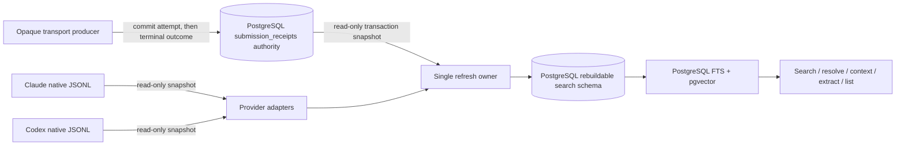

# Cross-Vendor Semantic Search Design

**GitHub Issue:** None

## Summary

Extend `cc-search-chats` from Claude-only full-text search into a local,
cross-vendor search and exact-resolution tool for native Claude and Codex chat
logs. A dedicated PostgreSQL 18 database is the derived search authority for
normalized metadata, provenance, PostgreSQL full-text search, and pgvector
embeddings. Large search relations and indexes live in a dedicated tablespace
on configured external storage; PostgreSQL data and WAL remain operator-managed.
Search refreshes appended native records before retrieval, exposes live progress
and freshness watermarks, and never locks the vendor logs that supervisors are
writing. If semantic refresh or the GPU is unavailable, hybrid search fails
explicitly while the last committed literal revision remains usable.

## Definition of Done

- Natural-language and exact-term queries search native Claude and Codex chats using hybrid semantic and FTS ranking. Agy and the transport archive are out of scope as searchable corpora.
- Default results include only visible user/assistant prose from primary sessions. `--agents` includes Claude subagent and Codex child-agent conversations. `--tools` adds lexical-only tool names, inputs, and results. Reasoning and developer/system instructions remain excluded.
- Embedding and retrieval run locally. Once the model is installed, searches work offline and transmit no chat content.
- An overnight bulk job maintains the baseline index. Searches detect and index appended records before retrieval and emit machine-readable phase, progress, elapsed-time, coverage, and freshness state rather than appearing hung, including when on-demand indexing takes roughly 30 seconds.
- Every indexed record has a provider-qualified stable locator. Exact resolution is independent of search ranking and distinguishes unique, missing, ambiguous, stale, unavailable, malformed, and unsupported-schema outcomes.
- Search, context, extract, list, and reference-only output share one additive JSON identity shape. Results report provider roots, projects or repositories, files searched, skipped or unreadable sources, unrecognised conversation-shaped records, and index freshness.
- Large indexes and local model data live under a configured external-storage root rather than inside the repository. The tool does not render transcript archives, summarise chats, or write notes, ADRs, plans, or constraints.
- Vendor `role=user` metadata does not prove human authorship. Each record separately reports `submitted_by` as `human`, `identified_harness`, or `unknown`; `unknown` is the default until positive provenance is available.
- Native Claude and Codex chats remain the content authority. Producer-owned PostgreSQL submission receipts are optional provenance evidence only. Exact digest, time, session, repository, and mutual-uniqueness checks may upgrade `submitted_by`; absent, fuzzy, or ambiguous correlation must not do so.
- Receipt DDL and producer writes remain owned by the transport project. This repository receives read-only access to the reviewed PostgreSQL contract and stores only rebuildable provenance observations. No receipt authority is currently deployed, so PostgreSQL starts clean rather than migrating nonexistent SQLite rows.

## Acceptance Criteria

### cross-vendor-semantic-search.AC1: Native cross-vendor search

- **Success:** One default query can return ranked native Claude and Codex
  prose results, and every result identifies its provider and native session.
- **Success:** Natural-language search fuses semantic and FTS ranks, while
  `--literal` performs FTS-only retrieval without loading the embedding model.
- **Failure:** Agy sessions and rendered transport archives never enter the
  searchable corpus, even when their files are reachable from a configured
  source root.

### cross-vendor-semantic-search.AC2: Content and session boundaries

- **Success:** Default results contain only visible user/assistant prose from
  sessions positively classified as primary.
- **Success:** `--agents` additionally includes sessions classified as agent or
  unknown, and reports the retained classification. `--tools` additionally
  searches persisted tool names, inputs, and results through FTS only.
- **Success:** `--literal --tools --exhaustive` returns every matching tool or
  prose occurrence in deterministic locator order; ranked search never claims
  to be exhaustive.
- **Failure:** Reasoning, thinking, developer instructions, system instructions,
  injected context, and unrecognised content shapes are not indexed or returned
  by any flag. The existing `--everything` flag is rejected with migration
  guidance rather than retaining its reasoning-inclusive meaning.

### cross-vendor-semantic-search.AC3: Local semantic model

- **Success:** Semantic passages and queries use
  `nvidia/Nemotron-3-Embed-8B-BF16`, the model-card passage/query prefixes,
  1024-dimensional Matryoshka slicing, and post-slice normalization.
- **Success:** After explicit installation into the operator-configured model
  cache, indexing and search work with network access disabled and transmit no
  chat content.
- **Failure:** Missing semantic dependencies or model files produce a nonzero,
  machine-readable error with installation/remediation state; runtime commands
  do not download a model implicitly or redirect package/model caches.

### cross-vendor-semantic-search.AC4: Scheduled and on-demand freshness

- **Success:** A scheduled `index` command can build and compact the baseline
  corpus overnight. A later search discovers new files and complete appended
  records and refreshes them without reparsing unchanged files.
- **Success:** Native Claude/Codex writers are never locked. Each refresh records
  a per-file byte watermark, and a source that advances during refresh is
  reported as advanced rather than falsely described as fully current.
- **Success:** One cross-process refresh owner serializes index writes. Other
  callers continue reading committed snapshots or emit `waiting_for_index`
  progress until the requested freshness is committed.
- **Failure:** Truncation, rotation, replacement, prefix changes, partial final
  JSONL records, and unsupported schema changes cannot be mistaken for a clean
  append. The affected source is reparsed or skipped with an explicit reason.

### cross-vendor-semantic-search.AC5: Observable work and semantic failure

- **Success:** Scan, parse, FTS commit, model preflight/load, embedding, semantic
  commit, query embedding, retrieval, and completion emit structured phase,
  elapsed-time, completed-unit, total-unit when known, and freshness events.
- **Success:** Human output and NDJSON progress identify the active index owner
  and continue emitting a heartbeat during a long phase, so a roughly
  30-second refresh does not appear hung.
- **Failure:** If semantic refresh fails, staged semantic rows do not become
  current, the last valid semantic revision remains intact, current FTS state
  is retained, and hybrid/semantic search exits nonzero rather than serving
  stale vectors.
- **Failure:** Model-load, query-embedding, or VRAM failure reports the failed
  phase, available/required VRAM when measurable, semantic freshness, and the
  literal text `Literal search is required for complete current results`, plus
  an executable `search --literal ...` form. No alternate model is selected.

### cross-vendor-semantic-search.AC6: Stable identity and exact resolution

- **Success:** Search, context, extract, list, provenance evidence, and
  reference-only output use the same provider-qualified identity object and
  canonical locator string.
- **Success:** Exact resolution uses provider/session/record identity and source
  verification, not FTS or semantic ranking. Physical duplicate records resolve
  to one logical message with explicit physical aliases.
- **Failure:** Exact resolution distinguishes malformed locator, unsupported
  provider schema, unavailable source, stale locator/index, no match, and
  multiple matches. It never collapses those outcomes into an empty result.

### cross-vendor-semantic-search.AC7: Coverage and JSON contract

- **Success:** Every JSON command returns an object with `schema_version`,
  command, identity-bearing results, source coverage, refresh state, semantic
  state, warnings, and a terminal status. Additive fields do not change existing
  field meanings within a schema version.
- **Success:** Coverage reports configured and resolved provider roots, projects
  or repositories, discovered/read/indexed/skipped/unreadable file counts,
  unknown session kinds, unrecognised conversation-shaped records, and source
  watermarks.
- **Failure:** A partial scan or skipped source cannot produce
  `completeness = "complete"`. Progress uses stderr so stdout remains one valid
  final JSON document.

### cross-vendor-semantic-search.AC8: Storage and component ownership

- **Success:** The dedicated database stores all large search tables and indexes,
  including staged and current vectors, in a PostgreSQL tablespace below a
  configured external data root. Its producer-owned `submission_receipts`
  schema is authoritative and separately owned; search migrations, refresh, and
  maintenance are confined to rebuildable search/provenance-observation
  relations. Refresh leases, status, and revision pointers are transactional
  PostgreSQL state rather than ad hoc lock/status files.
- **Success:** Before refresh, the application verifies the tablespace location,
  configured mount identity, writability, and sufficient peak rebuild space. A
  missing/read-only/replaced external mount fails without creating a fallback
  search database or writing into the underlying root-filesystem mountpoint.
- **Failure:** If PostgreSQL or the search database is unavailable, all search
  modes fail with a named database-unavailable error; “offline” promises no
  network dependency after installation, not daemonless operation.
- **Failure:** The feature does not modify native chats, render transcript
  archives, summarize conversations, author notes/ADRs/plans/constraints, or
  make the search index the authority for producer receipts.

### cross-vendor-semantic-search.AC9: Authorship classification

- **Success:** Every message retains vendor conversational `role` separately
  from `submitted_by`, whose closed values are `human`,
  `identified_harness`, and `unknown`.
- **Success:** An unmatched native `role=user` record is `unknown`. Positive
  allowlisted native harness provenance or one mutually unique exact
  native-record/receipt pair may upgrade it to `identified_harness` and records
  both compatibility cardinalities. `human` remains reserved until a future explicit positive
  producer/native contract exists.
- **Failure:** Fuzzy text, phrase containment, receipt absence, incompatible
  session/repository evidence, failed receipts, a native record compatible with
  zero or multiple receipts, or a receipt compatible with zero or multiple native
  records cannot establish human or harness authorship.

### cross-vendor-semantic-search.AC10: Independent provenance evidence

- **Success:** The producer-owned versioned PostgreSQL contract-metadata and
  evidence views are read in one read-only transaction snapshot and correlated by provider, session when
  available, repository/cwd, exact normalized digest and lengths, causal time,
  terminal outcome, and both compatibility cardinalities.
- **Success:** Native collaboration/Agent/SendMessage/local-mail provenance stays
  authoritative and does not receive duplicate synthetic receipt evidence.
- **Edge:** An absent, inaccessible, incompatible-version, incomplete, or
  malformed receipt contract/evidence view does not block chat indexing or literal search;
  affected messages remain `unknown` and diagnostics report why evidence could
  not be used. Loss of the entire PostgreSQL database remains the search-wide
  `database_unavailable` case.
- **Failure:** Search-chats never inserts, updates, deletes, or synthesizes
  producer receipts, never migrates or maintains their schema, and never claims
  historical uncertainty was resolved.

## Glossary

- **Content class** — A closed parser classification such as visible prose,
  tool input/output, or excluded private/instruction material.
- **Corpus revision** — A monotonically increasing search-index revision bound
  to exact per-source watermarks.
- **Exact resolver** — Lookup by provider-qualified source identity, independent
  of ranked search.
- **FTS revision** — The corpus revision selected by the current PostgreSQL
  literal-search pointer.
- **Logical message** — One conversational message after provider-specific
  physical duplicates have been canonicalized.
- **Physical alias** — A native record that refers to the same logical message
  as another native record.
- **Primary session** — A session positively identified as a top-level human-
  facing Claude or Codex conversation; it does not imply human authorship for
  each `role=user` message.
- **Semantic revision** — A validated set of pgvector rows and chunk metadata
  produced by one model/chunker configuration for one corpus revision and made
  visible by an atomic revision-pointer update.
- **Source watermark** — The identity, size, and complete-record byte boundary
  through which one native file was read.
- **`submitted_by`** — Provenance classification independent of conversational
  role: `human`, `identified_harness`, or `unknown`.

## Architecture

### Measured corpus and design consequence

The 2026-08-10 read-only audit found 9,603 Claude JSONL files (5.9 GiB) and
704 Codex JSONL files (1.3 GiB). Visible text comprised 267,877 user/assistant
messages and approximately 264 million characters. A provisional
3,000-character/400-character-overlap estimate yielded 323,498 semantic chunks,
including agent sessions. At 1024 float32 dimensions, those vectors occupy about
1.26 GiB before metadata, indexes, and temporary staged replacements.

These are a dated planning snapshot, not an execution oracle. Storage preflight,
semantic row counts, and the backend benchmark remeasure the current corpus and
record their commands and inputs before authorizing production behavior.

That scale does not justify an approximate nearest-neighbour index before an
exact-scan benchmark demonstrates a problem. The first backend is PostgreSQL 18
with pgvector: PostgreSQL owns normalized metadata and full-text search, and
pgvector stores normalized 1024-dimensional float32 vectors. Retrieval performs
an exact filtered scan initially. HNSW remains an internal optimization only if
real cold/warm measurements demonstrate a need; it does not change identities,
revision semantics, or the JSON contract.

### Data flow and ownership



Native files remain content authority. The producer-owned receipt schema is the
authority for opaque-transport submission evidence. Search relations and
vectors are derived state that may be discarded and rebuilt, but the shared
database as a whole is not disposable because receipt authority is present.
Supervisors write only through the producer receipt contract, do not write the
search schema, and refreshes do not lock native logs.

### Provider adapters and fail-closed parsing

Each provider adapter owns discovery, schema recognition, session-kind
classification, physical-record identity, visible-content extraction, and
source verification. Both emit one common immutable record model:

```text
provider, source_session_id, logical_message_id, physical_locator,
source_file_relative, source_line, source_byte_offset, source_digest,
timestamp, role, session_kind, conversation_epoch, content_class, text,
repository/cwd
```

`session_kind` is `primary`, `agent`, or `unknown`. Default search admits only
`primary`; `--agents` admits all three while preserving the classification in
output. This prevents an unrecognised new subagent origin from silently entering
default results.

Adapters use an allowlist of understood record/content shapes. Recognized visible
text becomes prose. Recognized tool-use/tool-result blocks become tool rows.
Known reasoning/thinking/system/developer/injected shapes and all unrecognized
conversation-shaped payloads are excluded. Unknown shapes increment coverage
diagnostics rather than being flattened permissively.

Provider adapters also emit recognized compression/compaction boundaries as
non-searchable session metadata. Messages carry a zero-based
`conversation_epoch`; a session with no recognized boundary has epoch 0.
Claude `compact_boundary` and compatible Codex compaction records advance the
epoch only under their provider-specific schema contracts. Unknown boundary
shapes are diagnostic and never shift later messages speculatively. Search and
extract retain the existing epoch filter, while list/extract output retain epoch
counts and boundary metadata without indexing summaries as ordinary prose.

Claude message UUIDs provide the preferred physical identity. Codex
`response_item` message IDs are preferred when present. For Codex messages with
no native ID, the fallback binds session ID, complete-record ordinal, and an
exact source-record digest. Codex event/response duplicates are canonicalized as
one logical message; every retained native occurrence remains a physical alias
that exact resolution can report. Duplicate timestamp compatibility requires
both outer timestamps to parse as timezone-aware ISO-8601 values and to be
nondecreasing in physical-record order. It does not impose a duration cutoff.
The other pairing facts remain exact: provider session, source file,
conversation epoch, role, text digest, opposite recognized projection families,
mutual uniqueness, and no intervening visible prose message. This rule is based
on a 2026-08-11 read-only snapshot of 792 native Codex files: 32,752
consecutive-visible exact-role/text opposite-family pairs had valid timestamps
in physical order; 32,749 were physically adjacent, three were separated only
by non-prose metadata, and 11,505 had unequal timestamps spanning
0.001–20.609 seconds. The observed upper value is evidence against an equality
rule, not a timeout to encode.

### Provider-qualified locators

Canonical locator version 1 has provider-specific record keys:

```text
ccchat:v1:claude:<session-id>:uuid:<message-uuid>
ccchat:v1:codex:<session-id>:id:<item-id>
ccchat:v1:codex:<session-id>:ordinal:<ordinal>:sha256:<record-digest>
```

The serialized JSON identity also carries logical message ID, source-relative
path, line, byte offset, digest, and physical aliases. Absolute storage roots are
not identity, so moving `~/.claude/projects` or `~/.codex/sessions` behind a
configured root/symlink does not invalidate references. Line and byte offset are
accelerators, not proof: resolution verifies provider, session, native ID when
available, and digest/cardinality.

Resolution reads the native source directly when possible. It does not issue an
FTS/vector query. Named terminal states are:

```text
resolved, no_match, multiple_matches, source_unavailable, stale_source,
stale_index, malformed_locator, unsupported_provider_schema
```

`resolve LOCATOR` exposes this exact operation; `resolve --reference-only`
returns the verified identity, aliases, provenance, and source coordinates
without message text. `context` accepts the same canonical locator rather than
an unqualified Claude UUID. `extract` retains convenient session-ID input but
accepts `--provider` and returns `multiple_matches` when an unqualified session
ID is not unique across providers.

Provider-qualified identity cannot be represented honestly by the existing
Claude-only JSON schema version 1 fields. Command cutover therefore makes one
intentional version-2 break and updates the bundled skill/command in the same
phase. Every version-2 response has common `schema_version`, `command`,
`status`, `coverage`, `refresh`, `semantic`, and `warnings` fields plus
command-specific data. Every message-bearing item embeds the same `identity`
object containing provider, source session, logical message, canonical locator,
physical aliases, and source coordinates. PostgreSQL surrogate keys and absolute
provider roots are never public identity. Version 2 then evolves additively.

### PostgreSQL schema and cutover

The dedicated `cc_search_chats` database on the local PostgreSQL 18 cluster has
two ownership domains. `cc_search_chats_owner` owns the rebuildable application
schema and relations. `cc_submission_receipts_owner` owns the authoritative
`submission_receipts` schema; its DDL and migration ledger belong to the
producer/transport project. `cc_submission_receipts_writer` may invoke only the
producer's reviewed attempt/outcome write interface and cannot mutate search
relations. The least-privilege `cc_search_chats_app` role receives its required
application DML plus schema `USAGE` and `SELECT` only on the producer-published
versioned contract-metadata and evidence views; it has no privilege on physical receipt relations and
cannot mutate receipt authority.
Provisioning creates roles, the database, `vector`, and the application schema;
producer deployment creates its own schema. Each migration runner is restricted
to its owned schema, and normal commands cannot create databases, roles,
extensions, tablespaces, schemas, or relations.

Principal relations are normalized around stable provider identity:

- small natural-key vocabulary tables define provider, session kind, content
  class, submission classification, run state, and terminal outcome values;
- `source_root`, `source_file`, and `source_observation` record configured roots,
  schema observations, file identity, scan outcomes, and exact watermarks;
- `chat_session` records provider session identity, repository/cwd, session kind,
  parent linkage, and activity; `session_epoch` records recognized provider
  compaction boundaries and their non-searchable metadata;
- `logical_message`, `message_version`, and `message_locator` represent canonical
  messages, revision visibility including conversation epoch, and every physical
  alias;
- `prose_content` and `tool_content` each have a stored `tsvector` generated with
  the PostgreSQL `simple` configuration and a GIN index; prose and tools remain
  separately selectable;
- `provenance_evidence` records read-only correlations without becoming receipt
  authority; immutable `provenance_revision`/`provenance_assessment` rows and a
  singleton `provenance_state` pointer select one atomic effective-classification
  snapshot for one target FTS revision with authority observation and match
  cardinality;
- `index_run`, `corpus_revision`, `corpus_revision_source`, and `index_state`
  record attempted work, exact source membership, and current literal/semantic
  revision pointers;
- `semantic_profile` and `semantic_revision` bind one immutable model/tokenizer/
  chunker contract to one corpus revision; reusable `semantic_embedding` rows
  store validated `vector(1024)` values by complete profile and prefixed-input
  digest; `semantic_chunk` records revision membership, message/chunk identity,
  bounds, and the selected reusable embedding.

Required scalar fields are `NOT NULL`; nullable columns represent genuinely
unknown or inapplicable information. Foreign keys, uniqueness constraints, and
closed vocabulary relations enforce provider-qualified identities and state
transitions in the database. SQL migrations are ordered, transactional where
PostgreSQL permits, and recorded in a migration ledger. The implementation also
creates or updates `docs/architecture/database.md` with table ownership,
cardinality, keys, invariants, and revision visibility.

The producer-owned schema publishes one versioned, single-row read-only contract
metadata view and one versioned read-only evidence view with one normalized row
per receipt. Their reviewed identifiers, columns/types, normalization, contract
version/checksum, grants, and migration rules are a
blocking Phase 3 input; search does not infer them from the provisional SQLite
layout or from the producer's internal tables. The view must expose the stable
receipt UUID, exact payload SHA-256 and lengths, sender/transport, target
provider/session/repository/cwd, attempted/completed times, and terminal outcome
needed for correlation. The producer's current physical direction is an
immutable attempt plus at most one immutable terminal outcome, but that layout is
hidden behind the views.

Producers commit an attempt before sending; failure to commit means no send.
Terminal recording is idempotent for an identical outcome and rejects a
conflicting one. Failure after input may have been submitted remains an unretried
`indeterminate` attempt. An attempt without a terminal outcome remains a valid
diagnostic row and cannot upgrade attribution. Search codifies and validates only
the published view contracts without owning producer DDL or importing producer code.

Logical-direction approval does not freeze this interface. It authorizes the
producer to generate an uncommitted candidate bundle and executable disposable-
PostgreSQL evidence. Phase 3 receipt implementation remains blocked until that
exact bundle, its security/restore behavior, the shared path-identity convention,
and the causal-window basis receive independent review and a second human freeze.
Search never treats approval of prose as approval of unreviewed SQL or checksums.

The existing SQLite index is not row-migrated. PostgreSQL is rebuilt from native
Claude and Codex logs, then compared with the legacy index for covered Claude
content before commands cut over. The old database and code path remain available
until the PostgreSQL literal index passes schema, count, identity, search, and
coverage checks; only a later phase removes the superseded path. Native data is
never modified.

### Transactions, revisions, and refresh ownership

Parsing, model loading, and embedding occur outside database transactions.
Changed rows are loaded in bounded batches with Psycopg `COPY`, associated with
an `index_run`, and invisible to current-revision queries while incomplete. A
short final transaction validates row counts, source watermarks, and referential
integrity; retires replaced versions; records revision membership; and advances
the current FTS pointer. A semantic refresh similarly validates every expected
chunk before atomically advancing the semantic pointer. Interrupted or invalid
staging rows are diagnosable and reclaimable but are never current.

A session-level PostgreSQL advisory lock admits one refresh owner. The owner
publishes heartbeat, phase, progress, and requested/committed freshness in
`index_run`; it does not hold a write transaction while scanning, parsing,
loading a model, or embedding. Search/index callers that requested freshness wait
without a transaction while reporting `waiting_for_index`; they do not silently
satisfy that request from an older committed revision. Read-only status and an
exact native resolution whose locator already names its source may inspect
committed state without requesting refresh. Advisory-lock ownership is released
automatically if the database session dies, so stale PID-file recovery is
unnecessary.

Search opens a read-only `REPEATABLE READ` transaction, reads the selected FTS
and semantic revision pointers once, and performs metadata, lexical, and vector
queries in that snapshot. Literal search requires only the current FTS pointer.
Hybrid search requires the selected semantic revision's
`target_fts_revision_id` to equal the selected current FTS revision ID; a
mismatch is an explicit semantic-staleness error, not permission to mix
revisions.

### External PostgreSQL storage

Production configuration points `CC_SEARCH_DATA_ROOT` at
`/media/brian/storage/cc-search-chats` on this machine. A privileged provisioning
step creates an empty directory such as
`/media/brian/storage/cc-search-chats/postgresql` with ownership and permissions
for the PostgreSQL cluster account, creates a dedicated tablespace there, and
makes it the default and temporary tablespace for `cc_search_chats`. Application
tables, indexes, staging rows, and query spill therefore use external storage.
The shared cluster's catalog, configuration, and WAL remain in the
operator-managed PostgreSQL cluster; the application does not relocate them.

Provisioning records the expected filesystem identity and tablespace location.
Before a refresh, the application compares the configured root and PostgreSQL's
reported tablespace location, verifies the expected mount/device and read-only
flags, performs a bounded PostgreSQL temporary write/read probe through the
runtime role in the configured temporary tablespace, and computes a conservative
peak-space estimate from catalog-measured current heap/index allocation, retained
live data, operation-specific staged heap/index rows, semantic embedding and
membership counts, selected exact/ANN index construction scratch, configured
temporary-spill allowance, and a named safety margin of the greater of 20% of
incremental peak or 8 GiB. The estimate reports `current_allocated_bytes`, every
incremental component, `projected_peak_allocated_bytes`, and nonzero
`required_free_bytes`; unknown/unmeasurable inputs fail before staging rather
than becoming zero. The CLI's OS user is not expected to have direct write
permission to the postgres-owned tablespace directory. Read-only status performs
no probe; it reports mount/catalog facts and the last recorded successful
preflight and component breakdown. A missing, replaced, read-only, database-
unwritable, or insufficient mount fails closed. The tool never creates a
substitute database or tablespace on the root filesystem.

The 2026-08-10 host upgrade established PostgreSQL 18.4 and packaged pgvector
0.8.6, preserved the stopped PostgreSQL 16 cluster and a full logical backup,
verified 329 non-template databases after migration, and verified that the
running server uses the `postgres` OS account. The operational runbook retains
the PostgreSQL 16 rollback cluster and logical backup until search-database
provisioning and a post-restart verification pass.

Model and package caches are operator configuration, not application state. The
application reports their resolved paths but never overrides them. On this
machine `HF_HOME`, `TORCH_HOME`, `UV_CACHE_DIR`, `PIP_CACHE_DIR`, and
`XDG_CACHE_HOME` already point below `/media/brian/storage/.cache`.

### Incremental refresh and concurrent native writers

A lightweight discovery pass stats every configured native session file. Each
checkpoint records provider root, relative path, device/inode where meaningful,
size, nanosecond mtime, last complete-record byte offset, absolute next record/
line coordinates, prefix/tail fingerprints, and the adapter's immutable parser
continuation state: next conversation epoch, recognized boundary state, and
duplicate-canonicalization carry. An unchanged checkpoint is skipped. A valid
append reads only bytes after the prior complete-record boundary and resumes
with that exact state. Replacement, shrinkage, prefix change, or incompatible
schema triggers a full source reparse from epoch 0 or explicit skip. A canonical
event/response pair must inhabit the same epoch and cannot cross a recognized
compaction boundary.
If a previously represented source is temporarily unreadable, the next revision
retains its last committed observation and content, records the failed current
attempt separately, and reports partial coverage; absence of a successful read
never authorizes silent deletion.

At refresh start, each file receives a target size. Parsing stops at the last
complete newline-delimited record at or below that size. Native writers may
continue appending. A final stat records whether the file advanced and how many
bytes remain pending. Freshness is therefore a precise watermark, not a claim
that an actively changing corpus was frozen.

One refresh owner holds the session-level advisory lock described above. Its
short heartbeat updates name the database session and run, while PostgreSQL
itself releases ownership if that session ends. A second refresh caller emits
`waiting_for_index` and waits for or reuses the committed revision rather than
starting duplicate parsing or model work.

The FTS revision commits independently so current literal search survives a
semantic failure. Semantic search requires the current semantic revision to
target the selected current FTS revision for the corpus. A mismatch is explicit
semantic staleness, never an invitation to serve the previous semantic revision
silently.

The opt-in overnight unit invokes `index --all --semantic`. That composed
operation refreshes FTS, provenance observations, and semantic state in order.
It reports success only when the selected semantic revision targets the newly
selected FTS revision under the requested profile; maintenance dry-run follows
only that success. Semantic failure leaves the newly committed FTS revision
literal-searchable, returns a nonzero partial terminal state, and does not let the
timer or status claim a fresh hybrid baseline.

### Semantic chunks and vectors

Only visible prose receives embeddings. A tokenizer-aware, versioned chunker
splits within one logical message—never across turns—targeting 768 content
tokens, with a 1024-token hard maximum including the passage prefix and model
special tokens, and 96-token content overlap. Short messages remain one chunk.
Each chunk records message identity, ordinal, token and character bounds,
`chunker_id`, `model_id`, vector dimension, and source-text digest. Changing any
model, prefix, dimension, tokenizer, or chunker parameter requires a complete
semantic revision without invalidating FTS.

Passages use the model-card `passage: ` prefix; queries use `query: `. Prefixing
is explicit and applied exactly once. The model's mean-pooled 4096-dimensional
output is validated; the first 1024 Matryoshka dimensions are sliced and
re-normalized before float32 persistence.
Chunk hits are collapsed to a logical message by the best semantic chunk before
hybrid fusion, preventing overlap from producing duplicate results.

The first vector backend stores normalized rows in pgvector `vector(1024)`
columns. A single SQL query joins the selected semantic revision to current
message/session metadata, applies agent/provider/project/date filters before
`ORDER BY` and `LIMIT`, and uses inner-product distance over normalized vectors
for exact cosine ordering. Excluded rows therefore cannot starve eligible
results. A real-corpus cold/warm benchmark records exact pgvector scan latency,
buffer use, and memory before enabling hybrid search by default. No HNSW index is
created unless that benchmark demonstrates a user-visible need; an index remains
an internal optimization rather than a new search contract.

### Model and GPU lifecycle

Core storage adds a compatible pinned range for Psycopg 3. Semantic support is
an explicit dependency extra containing the Python pgvector adapter and
compatible pinned ranges for CUDA PyTorch, Transformers, and NumPy. The direct
Transformers adapter owns tokenization, mean pooling, slicing, and normalization;
Sentence Transformers is not an application dependency. A compatibility spike
must prove Python 3.14 installation,
PostgreSQL 18/server-side pgvector round trips, model load, 1024-d output,
normalization, offline reload, and one bounded batch before implementation
assumes the stack is viable.

The embedding profile pins the exact model and tokenizer snapshot, currently
`c44c20ab3f6b430336706847a6372de4b2eb3dbd`, plus prefixes, pooling,
dimensions, normalization, attention implementation, package versions, and
chunker parameters. A dedicated `model install` operation is the only
network-capable path; it requires explicit operator action and uses the already
configured Hugging Face cache without redirecting it. `model status` and all
runtime commands are read-only with respect to that cache.

Runtime model loading uses local files only and `trust_remote_code=False`. SDPA
is the initial attention implementation; FlashAttention is not an implicit
dependency. A separate session-level advisory
lock prevents concurrent commands from loading multiple 8B copies onto one GPU.
The model is not kept in a resident daemon; connection/process exit releases the
lock and process exit releases VRAM. Preflight reports CUDA/runtime
availability and best-effort total/free/estimated-required VRAM. Allocation is
still attempted defensively because preflight cannot predict fragmentation or a
racing external allocation.

Embedding writes a complete staged semantic revision and advances its pointer
only after every expected chunk and text/vector invariant validates. OOM,
interruption, incompatibility, or validation failure leaves the previous
semantic pointer unchanged. Query embedding failure follows the same loud
literal-search boundary even when the stored semantic revision itself is
current. Because model loading and query embedding occur outside a database
transaction, retrieval rechecks the selected FTS revision, semantic revision,
and complete embedding profile in its read-only repeatable-read snapshot and
retries or fails if they changed during embedding.

### Search modes and ranking

`search` has three explicit retrieval semantics:

| Mode | Behaviour | Completeness claim |
|---|---|---|
| default | Natural-language FTS candidates plus semantic candidates, fused by reciprocal-rank fusion | Ranked top results only |
| `--literal` | Prose FTS only; add tool FTS with `--tools` | Ranked literal results |
| `--literal --exhaustive` | Stream/page every deterministic FTS occurrence; add tool occurrences with `--tools` | Exhaustive through reported source watermarks |

`--all` retains its current meaning of all indexed projects/providers and is not
repurposed to mean every result. `--everything` is removed because no supported
mode exposes reasoning/developer/system material. Natural-language lexical
candidate generation derives `simple`-configuration lexemes with PostgreSQL,
deduplicates them, and ORs only safely server-produced lexemes; user input never
becomes raw `tsquery` syntax. Literal mode uses the documented safe
`websearch_to_tsquery('simple', ...)` term, quoted-phrase, `OR`, and exclusion
grammar. Blank or non-indexable input is invalid rather than a successful empty
search.

Hybrid ranking uses unweighted reciprocal-rank fusion over bounded lexical and
semantic candidate lists. For output limit `n`, each component depth is
`min(1000, max(100, 5*n))`; ranked output limits are restricted to 1–200. With
one-based component ranks and `k=60`, each present component contributes
`1/(60+rank)`. Exact rational arithmetic and canonical-locator tie-breaking make
fusion deterministic. Raw PostgreSQL `ts_rank_cd` and inner-product scores are
exposed diagnostically but are not normalized into a shared pretend scale.
Component ranks, winning lexical occurrence/semantic chunk, fusion parameters,
filters, and deterministic tie-breakers are returned in JSON. Exact resolution
and exhaustive enumeration never use hybrid ranking.

The exhaustive unit is one persisted searchable content row: one prose row per
logical message or one tool-name/input/result row. Exhaustive output orders by
canonical locator, fixed content-class order, ordinal, and digest, and reports
every such row exactly once through the selected revision's watermarks. Ranked
literal and hybrid modes instead collapse winning occurrences/chunks to one
logical message before their component limits.

### Provenance correlation

Search-chats reads the producer-owned versioned contract-metadata and evidence views through its
least-privilege PostgreSQL role in one read-only `REPEATABLE READ` snapshot. It
requires the exact supported contract version/checksum, view identifier,
columns/types, normalization, and grants. Receipt authority and search writes
share a server but not ownership; search migrations and maintenance cannot
address the producer schema, while the view exposes only producer-committed
normalized evidence.

For a native user record, the consumer applies the receipt contract's
`utf8-nfc-lf-v1` normalization and selects compatible confirmed candidates by
provider, session when present, exact cwd, exact repository whenever the receipt
carries one, digest, normalized lengths, and
bounded causal time. A native record may set
`submitted_by=identified_harness` only when it has exactly one compatible receipt
and that receipt has exactly one compatible native record in the bounded corpus.
All other compatibility graphs remain `unknown`; the consumer does not guess a
maximum matching.

The 2026-08-11 controlled-send seam test captured an attempt at
`2026-08-11T06:59:39.931721Z` and the one canonical native user record at
`2026-08-11T07:00:11.376Z`: a known-positive interval of 31,444,279 microseconds.
It therefore falsifies the draft 30-second upper bound. The producer contract must
freeze a replacement causal interval from reviewed evidence; search consumes that
value and does not choose an independent cutoff. Time remains part of causal
ordering and ambiguity control alongside exact identity, bindings, digest, lengths,
and mutual uniqueness. The evidence locators are the producer session at line 4519
of `/home/brian/.codex/sessions/2026/08/10/rollout-2026-08-10T15-46-39-019fea35-7485-7280-adc0-47393145d1cf.jsonl`
and lines 1, 9, and 10 of
`/home/brian/.codex/sessions/2026/08/11/rollout-2026-08-11T16-56-12-019fef9b-7cad-7193-b51c-b3f45f49be5e.jsonl`.
Line 9 is the canonical `response_item/message/role=user`; line 10 is its
`event_msg/user_message` projection, not a second logical message. Producer and
consumer must also share one reviewed path
derivation/normalization fixture; neither infers symlink, worktree, nonexistent,
or lexical-path handling from the other repository's implementation.
Native collaboration/Agent/SendMessage/local-mail records use their own positive
metadata. There is no text similarity fallback and no `role=user` shortcut to
`human`.

The initial audited native schemas provide positive harness/agent provenance but
no sufficiently strong human-positive field. The closed `human` value is
reserved for a future producer/native signal with an explicit contract; initial
adapters do not emit it merely because a record appeared in a primary session.

Historical correlation is a separately reported best effort over existing
evidence. Future producer receipts improve positive harness attribution but do
not change the conservative cardinality rule. Receipt producer implementation,
availability policy, and PostgreSQL DDL remain outside this repository. A
producer-owned importer is required only for a deployment that positively
identifies an older receipt authority; none is deployed here.

Receipt evidence changes independently of message text, so provenance assessment
has its own immutable revision and singleton current pointer; promotion of that
pointer does not advance the FTS or semantic revision. The native classification
stored with a message version remains authoritative; an assessment records
effective classification, evidence rows, both native-to-receipt and
receipt-to-native compatibility cardinalities,
receipt-authority status, and the exact database/schema-version/snapshot
observation used. If the receipt schema is currently absent, inaccessible,
incompatible, incomplete, or malformed, a new current provenance revision
records unknown for receipt-derived attribution; prior evidence remains stale
diagnostic history but cannot currently upgrade `submitted_by`. Native
positive evidence remains effective. A provenance revision targets one FTS
revision. If FTS advances first, consumers report provenance stale and use only
the selected message versions' native classification until a complete matching
provenance revision is promoted; they never join prior receipt-derived upgrades
across that mismatch and never block literal search on receipt refresh.

The current deployment has no receipt authority: the producer changes remain
uninstalled and the formerly proposed fixed SQLite file does not exist. The
producer therefore creates PostgreSQL as the clean initial authority, validates
its writer/contract/evidence-view path, and only then enables receipt-required opaque
sending; search enables correlation after the reviewed views exist. There is no
SQLite import, freeze, rollback file, or dual-authority interval. If another
deployment later positively identifies an existing receipt authority, activation
stops for a separately reviewed producer-owned migration plan; search never
invents or owns that importer.

### Progress, terminal state, and errors

The canonical progress stream is NDJSON on stderr. JSON result mode and
non-TTY execution always use it; interactive human mode may render the same
typed events compactly, and an explicit progress option can force NDJSON.
Stdout remains the final human result or one valid JSON object. Events share
these stable fields:

```text
schema_version, sequence, event, run_id, phase, state, elapsed_ms,
completed_units, total_units, owner, fts_revision, semantic_revision,
source_watermark, warning, error, coverage, refresh, semantic
```

Phases are `scan`, `parse`, `fts_commit`, `model_preflight`, `model_load`,
`semantic_embed`, `semantic_commit`, `query_embed`, `retrieve`, and `done`.
Long phases emit a heartbeat at least every five seconds. Refresh waiters use
database notifications only as wakeups and re-read transactional run/lock state;
session advisory-lock ownership, not heartbeat age, decides ownership. Every
command emits exactly one terminal event. In JSON result mode it precedes one
final JSON object, and their terminal status, revisions, coverage, and semantic
state agree so a caller does not need retained stderr to interpret results.
Human result mode derives its final presentation from the same terminal state.

Errors have stable names in JSON and distinct nonzero process outcomes where a
caller must branch: invalid invocation/locator, source unavailable, no match,
multiple matches, stale state, unsupported schema, semantic unavailable, and
internal failure. Literal success after a prior semantic failure is an ordinary
success whose diagnostics still report semantic state.

## Existing Patterns Preserved and Changed

- Preserve argparse, functional-core/imperative-shell separation, read-only
  native sources, integrity checks, current local-first/project scoping, additive
  JSON evolution, and conservative exact receipt correlation.
- Replace Claude-only discovery/parsing with provider adapters and provider-
  qualified compound identity.
- Replace the application-owned SQLite/FTS5 index with a dedicated PostgreSQL 18
  database using PostgreSQL full-text search and pgvector. Keep the legacy index
  intact until independent cutover checks pass, then remove its runtime path.
- Replace transient reasoning-inclusive `--everything` with persistent,
  explicitly requested lexical tool search; reasoning remains excluded.
- Keep literal operation available without semantic dependencies. Psycopg becomes
  the core storage dependency; the Python pgvector adapter, NumPy, and CUDA/model
  packages remain in an explicit semantic extra.
- Rebuild from native logs into a new externally tablespaced schema rather than
  forcing the current UUID-primary-key database through an unsafe row migration.
- Insulate repository discovery from ambient `GIT_DIR` by clearing Git routing
  variables or using explicit `git -C <candidate>` calls for every probe.

## Alternatives Considered

### Shared PostgreSQL 18 with pgvector — selected

PostgreSQL supplies transactional revision promotion, crash recovery,
session-scoped advisory locks, mature migrations, full-text search, and filtered
vector queries in one authority. The existing host cluster has been upgraded
in place to PostgreSQL 18.4 with pgvector 0.8.6; the search database and large
relations are isolated in a dedicated external tablespace. This choice makes the
local PostgreSQL daemon a search dependency and adds cluster ownership,
authentication, backup, restore, and tablespace operations to acceptance. Those
costs are explicit rather than reimplemented through SQLite leases, WAL recovery,
and bespoke immutable-file promotion.

### SQLite/FTS5 with immutable vector files

This retains a daemonless literal path and the current standard-library runtime,
but requires application-owned writer leasing, heartbeat recovery, WAL/checkpoint
discipline, filesystem generation promotion, cross-store snapshot coordination,
and filtered exact-vector joins outside SQL. It also retains SQLite as the
bottleneck the operator specifically does not want for this workload. Rejected
in favour of PostgreSQL. A separate SQLite receipt authority was also rejected:
logical ownership does not require another database engine, and every opaque
transport instead writes the producer-owned PostgreSQL schema.

### FAISS approximate index

FAISS is mature and substantially reduces large-corpus search cost, but adds a
second native runtime and approximate-index tuning before the measured corpus
requires it. Filtering, incremental deletion, and deterministic rebuilds add
complexity. Deferred until the exact backend's real cold/warm benchmark fails an
observed usability need.

### Dynamic Qwen fallback

Qwen and Nemotron embeddings are incompatible spaces. A transparent fallback
would require a complete second semantic revision and would still not make an
8B model fit when Nemotron does not. Rejected by explicit product decision:
Nemotron only, with loud literal-search fallback.

### Long-lived embedding daemon

A resident process would reduce model-load latency but reserve roughly the model
weight footprint on the shared 4090 and interfere with other work. Rejected for
the initial design. Per-command loading exposes progress and releases VRAM on
exit.

## Implementation Phases

1. **Provider identity foundation.** Add failing fixtures for Claude and Codex
   discovery, session kind, content allowlists, duplicate canonicalization,
   provider-qualified locators, malformed/unsupported records, and ambient
   `GIT_DIR`; implement pure adapters and resolver models.
2. **PostgreSQL foundation and literal index.** Prove Python 3.14/Psycopg/
   PostgreSQL 18/pgvector compatibility; add a temporary real-cluster test
   harness, provisioning and ownership runbook, external tablespace checks,
   normalized schema and database architecture document, separate prose/tool
   FTS, source watermarks, append/rewrite detection, coverage state, advisory
   refresh ownership, atomic FTS revision promotion, and separate search/receipt
   role boundaries. Preserve the current SQLite search index until verification
   passes.
3. **Identity consumers, provenance, and cutover.** Move search/context/extract/
   list and reference-only output to the PostgreSQL-backed common identity
   shape; add exact resolver states and read-only correlation with native
   evidence and the producer-owned PostgreSQL receipt schema. Block on the
   reviewed producer view/writer/grant deployment and its clean-authority write
   gate, and compare covered Claude data and literal queries with the legacy
   search index before removing its runtime path.
4. **Semantic compatibility and pgvector storage.** Prove Python 3.14/CUDA/model
   compatibility, then implement the versioned tokenizer chunker,
   `vector(1024)` storage, exact filtered retrieval, semantic revision staging
   and atomic pointer advancement, model advisory lock, offline mode, and
   transactional failure tests with a fake embedder before GPU integration tests.
   Benchmark cold and warm exact filtered scans against the current corpus as a
   blocking input to Phase 5; do not make hybrid retrieval the default first.
5. **Hybrid and exhaustive search.** Add query modes, safe natural-language FTS
   candidates, filter-before-top-k vector retrieval, message-level collapse,
   reciprocal-rank fusion, literal/tool exhaustive enumeration, and deterministic
   component diagnostics.
6. **Operations and acceptance.** Add progress/heartbeat/terminal JSON,
   scheduled bulk/maintenance documentation, PostgreSQL backup/restore and
   database-unavailable behaviour, role/ACL reconstruction for both ownership
   domains, tablespace/mount/space checks, current-corpus benchmark monitoring,
   offline-network verification, and UAT queries covering cross-vendor
   retrieval, agents, tools, exact locators, provenance unknowns, active native
   writers, and forced VRAM failure.

Every phase follows red-green-refactor against provider fixtures and disposable
PostgreSQL 18 clusters initialized in test temporary directories with the
packaged `vector` extension. Tests never use the operator's live cluster and do
not require Docker. GPU/model tests are separately marked so the deterministic
unit suite never requires a downloaded model.

## Additional Considerations

- Relocating the 7.2 GiB native logs is a separate operational task. The locator
  scheme tolerates changed physical roots, but provider-client symlink/bind-mount
  behaviour must be tested with writers stopped before moving live data.
- The current external storage has enough space for this feature but is not an
  unlimited sink. External peak-space checks must account for model files,
  current relations and indexes, staged replacement rows, index construction,
  PostgreSQL temporary spill, and safety margin. Cluster-root monitoring must
  separately account for PostgreSQL WAL retained during bulk loading.
- Database backup/restore must include authoritative receipt rows and replay the
  reviewed owner/writer/search-reader grant manifest; rebuilding the search
  schema is never permission to drop or omit `submission_receipts`.
- Exact pgvector performance is a measured assumption, not a permanent
  constraint. A later HNSW index is permitted only after the benchmark identifies
  a real need and filtered recall/latency tests establish safe settings. The
  candidate is built first in an isolated production-sized clone outside the
  migration ledger and removed on rejection. Migration 0006 is written only
  after that gate passes; a failed target apply is repaired by a new compensating
  migration, never by editing applied migration bytes or leaving an orphaned
  candidate index.
- Source freshness is always bounded by reported watermarks. No finite search can
  truthfully include records created after its snapshot while a supervisor keeps
  writing.
- The tool reports classifications and evidence; it does not infer intent,
  summarize conversations, or decide which agent statements are trustworthy.
